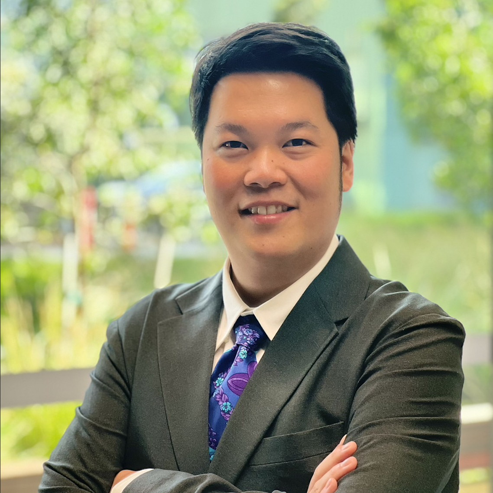

# About the Author

  

    
  

  

## A/Prof Kla Tantithamthavorn

**Associate Professor in Software Engineering**  
Faculty of Information Technology, Monash University, Australia

[chakkrit.com](https://chakkrit.com) · [Google Scholar](https://scholar.google.com.au/citations?user=idShgcoAAAAJ) · [LinkedIn](https://www.linkedin.com/in/kla-tantithamthavorn-49ab0176/) · [X/Twitter](https://x.com/klainfo)

  

---

**Kla Tantithamthavorn** is an Associate Professor in the Faculty of Information Technology at Monash University, Australia, and one of the most productive and internationally recognised software engineering researchers of his generation. He leads the Agentic Software Engineering Research, where his group advances the frontier of AI-native software engineering — combining rigorous empirical methods with cutting-edge AI technologies to transform how software is built, reviewed, and secured.

Beyond academia, Kla brings rare industry depth to his research. He served as **Principal Machine Learning Researcher at Atlassian**, where he led the **DevAI Research Team**, translating research innovations into AI-powered developer tools used by millions of engineers worldwide. This dual grounding in industrial practice and academic rigour positions him as a leading voice in agentic software engineering.

Kla's scholarly impact is exceptional by any measure. His work has been cited **over 8,600 times** (Google Scholar), with an **h-index of 44**. He has published **more than 100 peer-reviewed articles** in all of the prestigious SE venues (CORE A*/A), including - TSE, TOSEM, JSS, IST, EMSE, ICSE, FSE, ASE, ICSME, SANER — an output that places him among the top researchers worldwide in agentic software engineering.

---

## Research

Kla's research programme is organised around a central mission: **making AI agents reliable, safe, and effective collaborators in software engineering**. His group works across two interconnected themes.

### Agentic Software Engineering

His lab investigates the capabilities and limits of AI agents performing complex software engineering tasks end-to-end — from code generation and code review to security analysis and vulnerability repair:

- **Agentic Code Generation** — building autonomous agents that generate production-quality code (Work in progress)
- **Agentic Chrome Extension Generation** — end-to-end agent pipelines for browser extension development ([ICSE'26](https://arxiv.org/abs/2510.16823))
- **Agentic Code Review** — AI agents that conduct thorough, actionable code reviews ([ICSE'26](https://arxiv.org/abs/2601.01129))
- **Agentic Secure Code Review** — agents specialised in identifying security vulnerabilities during review ([Work in progress](https://arxiv.org/abs/2601.19138))
<!-- - **Agentic Vulnerability Repair** — autonomous repair of security vulnerabilities in real-world codebases (TSE'26) -->
<!-- - **Agentic Q&A** — agents that answer complex software engineering questions with high reliability (ASE'26) -->

### Agentic Software Engineering Guardrails

Equally, Kla's group develops the safety infrastructure needed to deploy AI agents responsibly — detecting failures, hallucinations, and adversarial misuse before they cause harm:

- **Multi-Turn Safety** — evaluating and enforcing safe behaviour across extended agentic interactions (Work in progress)
- **Malicious Skill Detection** — identifying and neutralising adversarial capabilities in agent skill libraries (Work in progress)
- **Hallucination Detection in Agentic Code Review** — detecting when AI reviewers fabricate issues or reasoning ([FSE'26](https://arxiv.org/abs/2601.19072))
<!-- - **Usefulness Detection in Agentic Code Review** — distinguishing genuinely helpful agent feedback from noise (Work in progress) -->
- **AI Guardrails for Enterprise Agentic Chatbot** — a family of defence systems including [**DecipherGuard**](https://arxiv.org/abs/2509.16870), [**SEALGuard**](https://arxiv.org/abs/2507.08898), and [**AdaptiveGuard**](https://arxiv.org/abs/2509.16861), providing robust, adaptive protection against prompt injection and policy violations in deployed LLM pipelines

---

*Connect: [chakkrit.com](https://chakkrit.com)*
