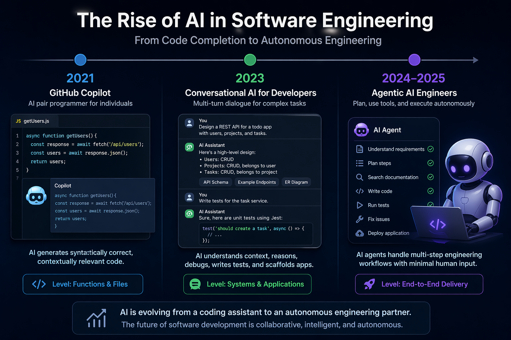
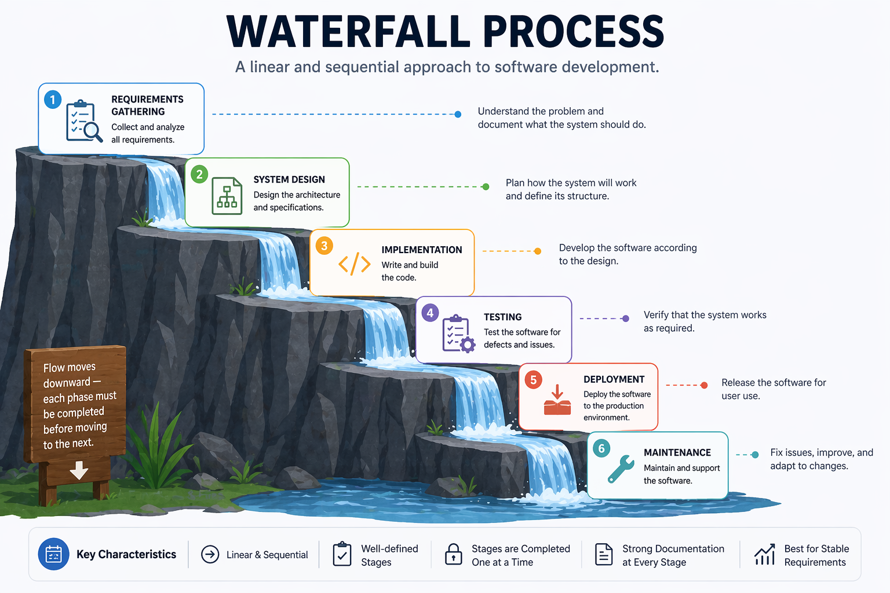

# Chapter 1: Software Engineering Fundamentals and Processes

> *"Software engineering is the establishment of and use of sound engineering principles in order to obtain economically software that is reliable and works efficiently on real machines."*
> — Friedrich Bauer, 1968 NATO Conference

---

## Learning Objectives

By the end of this chapter, you will be able to:

1. Describe the historical evolution of software engineering from its origins to the present day.
2. Explain the key software development lifecycle (SDLC) models: Waterfall, Agile, Scrum, and Kanban.
3. Articulate how AI is reshaping each phase of the SDLC and what this means for the role of the software engineer.

---

## 1.1 What Is Software Engineering?

Software engineering is the disciplined application of engineering principles to the design, development, testing, and maintenance of software systems. Unlike informal programming, software engineering emphasises process, quality, collaboration, and long-term maintainability.

The term was deliberately chosen. In 1968, NATO convened a conference in Garmisch, Germany, to address what organisers called the "software crisis" — a widespread recognition that software projects were routinely over budget, delivered late, and unreliable ([Naur & Randell, 1969](http://homepages.cs.ncl.ac.uk/brian.randell/NATO/nato1968.PDF)). The goal of using the word *engineering* was aspirational: to bring to software the same rigour, predictability, and professionalism that civil or mechanical engineers brought to bridges and engines.

That aspiration has guided the field ever since — and it remains relevant today, even as the tools, languages, and collaborators (including AI systems) have changed dramatically.


*Photograph from 1968 NATO Software Engineering Conference (University of Newcastle photo)*

### Why Software Engineering Matters

Consider two scenarios:

- **Scenario A**: A solo developer writes a script to process CSV files for personal use. It works, mostly. When it breaks, they fix it themselves.
- **Scenario B**: A team of 50 engineers builds a financial trading platform used by millions of customers. Bugs can cause financial losses. Downtime can trigger regulatory penalties.

Software engineering is primarily concerned with Scenario B — or with preparing developers who will eventually work on systems of that scale and consequence. The principles covered in this book apply whether you are building a mobile app, a machine learning pipeline, or an AI-assisted development tool.

---

## 1.2 A Brief History of Software Engineering

Understanding where software engineering came from helps explain why its practices exist and why they are changing again now.

### 1.2.1 The Early Years (1940s–1960s)

The first programmers wrote machine code directly — sequences of binary instructions hand-crafted for specific hardware. Programming was considered a clerical task; the real intellectual work was thought to be mathematics and system design.

As software grew more complex through the 1950s, assembly languages and early high-level languages like FORTRAN (1957) and COBOL (1959) emerged. Programs grew from hundreds of lines to hundreds of thousands. Managing this complexity became a serious problem.

### 1.2.2 The Software Crisis and Structured Programming (1968–1980s)

The 1968 NATO conference crystallised the software crisis. Projects like the IBM OS/360 operating system — documented famously by Fred Brooks in *The Mythical Man-Month* ([Brooks, 1975](https://en.wikipedia.org/wiki/The_Mythical_Man-Month)) — demonstrated that adding more programmers to a late project often made it later. Software complexity was not a resource problem; it was a conceptual one.

The response was *structured programming*, championed by Dijkstra, Hoare, and Wirth. Programs should be built from clear, hierarchical control structures — sequences, selections, and iterations — rather than the chaos of `GOTO` statements. This was the beginning of thinking about software as something that could be reasoned about formally.

### 1.2.3 Object-Oriented Programming and Software Patterns (1980s–1990s)

The 1980s and 1990s saw the rise of object-oriented programming (OOP) — a paradigm in which software is modelled as interacting objects with state and behaviour. Languages like C++, Smalltalk, and later Java brought OOP to mainstream development.

In 1994, the "Gang of Four" — Gamma, Helm, Johnson, and Vlissides — published *Design Patterns: Elements of Reusable Object-Oriented Software* ([Gamma et al., 1994](https://en.wikipedia.org/wiki/Design_Patterns)), cataloguing 23 reusable solutions to common software design problems. These patterns are covered in depth in Chapter 3.

### 1.2.4 The Internet Era and Agile Methods (1990s–2000s)

The World Wide Web transformed software from shrink-wrapped products shipped on disks to continuously evolving services. Release cycles had to shrink from years to weeks. Traditional plan-driven methods struggled to keep pace.

In 2001, seventeen software practitioners gathered in Snowbird, Utah, and published the [Agile Manifesto](https://agilemanifesto.org/) — a short document that valued:

> *Individuals and interactions over processes and tools*
> *Working software over comprehensive documentation*
> *Customer collaboration over contract negotiation*
> *Responding to change over following a plan*

Agile methods — including Scrum, Extreme Programming (XP), and Kanban — spread rapidly through the industry. They emphasised short iterations, continuous feedback, and adaptive planning rather than upfront specification.

### 1.2.5 DevOps and Continuous Delivery (2010s)

As agile teams delivered software faster, operations teams struggled to deploy and maintain it. The DevOps movement ([Kim et al., 2016](https://itrevolution.com/product/the-devops-handbook/)) broke down the wall between development and operations, promoting:

- Continuous integration (CI): merging code frequently, building and testing automatically
- Continuous delivery (CD): keeping software always in a deployable state
- Infrastructure as code: managing servers and environments through version-controlled scripts

This shift made the pipeline from code commit to production deployment a first-class engineering concern — covered in depth in Chapter 4.

### 1.2.6 The AI Era (2020s–Present)

In 2021, GitHub released Copilot, powered by OpenAI Codex — a large language model trained on billions of lines of public code. For the first time, AI could generate syntactically correct, contextually relevant code at the level of individual functions and files.

By 2023, models like GPT-4 and Claude could engage in multi-turn conversations about software design, debug complex issues, write test suites, and generate entire application scaffolds from natural language descriptions. 

By 2024–2025, *AI coding agents*, powered by agentic AI architecture, that can plan, use tools, and execute code autonomously - began to handle multi-step engineering tasks with minimal human intervention.

This is where this book begins.


*From Copilot to autonomous agents: AI has evolved from completing code to planning, building, testing, and delivering software end to end. (Illustrated by AI)*

---

## 1.3 The Software Development Lifecycle (SDLC)

The Software Development Lifecycle (SDLC) is a structured process for planning, creating, testing, and deploying software. While specific SDLC models differ in their details, most share a common set of phases:

| Phase | Key Activities |
|---|---|
| **Requirements** | Understand what the system should do |
| **Design** | Decide how the system will be structured |
| **Implementation** | Write the code |
| **Testing** | Verify the system works correctly |
| **Deployment** | Release the system to users |
| **Maintenance** | Fix bugs, add features, keep the system running |

### 1.3.1 Waterfall

The Waterfall model, introduced by Winston Royce in 1970 (though Royce actually presented it as a flawed approach in the same paper), organises development as a strict sequence of phases ([Royce, 1970](http://www-scf.usc.edu/~csci201/lectures/Lecture11/royce1970.pdf)):

Each phase must be completed before the next begins. The model assumes requirements can be fully and correctly specified at the start.


*A Waterfall Software Development Process (Illustrated by AI)*

**Strengths:**
- Clear milestones and deliverables
- Easy to manage and document
- Works well for projects with stable, well-understood requirements (e.g., certain embedded systems, government contracts)

**Weaknesses:**
- Requirements almost never remain stable
- Errors discovered late are expensive to fix
- Users see no working software until the end
- Poor fit for projects with high uncertainty

### 1.3.2 Agile Software Development

Agile is not a single methodology but a family of approaches united by the values in the [Agile Manifesto](https://agilemanifesto.org/). The core insight is that software requirements and solutions evolve through collaboration, and that the ability to respond to change is more valuable than adherence to a plan.

Agile teams work in short cycles called *iterations* or *sprints*, typically 1–4 weeks long. Each iteration produces a working, tested increment of software. Stakeholders review the increment and provide feedback that informs the next iteration.

Key Agile principles include:

- Deliver working software frequently (weeks, not months)
- Welcome changing requirements, even late in development
- Business people and developers work together daily
- Simplicity — the art of maximising the amount of work *not* done — is essential

### 1.3.3 Scrum

Scrum is the most widely adopted Agile framework ([Schwaber & Sutherland, 2020](https://scrumguides.org/scrum-guide.html)). It defines specific roles, events, and artefacts:

**Roles:**
- **Product Owner**: Represents stakeholders; owns and prioritises the product backlog
- **Scrum Master**: Facilitates the process; removes impediments; coaches the team
- **Development Team**: Self-organising group that delivers the increment

**Events:**
- **Sprint**: A time-boxed iteration of 1–4 weeks
- **Sprint Planning**: The team selects backlog items and plans the sprint
- **Daily Scrum**: A 15-minute daily standup to synchronise and identify blockers
- **Sprint Review**: The team demonstrates the increment to stakeholders
- **Sprint Retrospective**: The team reflects on the process and identifies improvements

**Artefacts:**
- **Product Backlog**: An ordered list of everything that might be needed in the product
- **Sprint Backlog**: The backlog items selected for the current sprint, plus the delivery plan
- **Increment**: The sum of all completed backlog items at the end of a sprint

```
┌─────────────────────────────────────────────────────────┐
│                    Product Backlog                       │
│  (ordered list of features, bugs, improvements)         │
└───────────────────────┬─────────────────────────────────┘
                        │ Sprint Planning
                        ▼
┌─────────────────────────────────────────────────────────┐
│                    Sprint (1–4 weeks)                    │
│                                                          │
│  Sprint Backlog → Daily Scrum → Working Increment        │
└───────────────────────┬─────────────────────────────────┘
                        │ Sprint Review + Retrospective
                        ▼
                  Next Sprint...
```

### 1.3.4 Kanban

Kanban, adapted from Toyota's manufacturing system by David Anderson ([Anderson, 2010](https://kanbanbooks.com/)), is a flow-based method that focuses on visualising work, limiting work in progress (WIP), and continuously improving flow.

A Kanban board visualises work as cards moving through columns:

```
┌──────────┬──────────────┬──────────────┬──────────┐
│ Backlog  │  In Progress │   In Review  │   Done   │
│          │   (WIP: 3)   │   (WIP: 2)   │          │
├──────────┼──────────────┼──────────────┼──────────┤
│ Task E   │ Task B       │ Task A       │ Task D   │
│ Task F   │ Task C       │              │          │
│ Task G   │              │              │          │
└──────────┴──────────────┴──────────────┴──────────┘
```

**Key Kanban practices:**
- **Visualise the workflow**: Make all work and its status visible
- **Limit WIP**: Prevent overloading; finish before starting more
- **Manage flow**: Track cycle time and throughput; identify bottlenecks
- **Improve collaboratively**: Use data to drive continuous improvement

Kanban suits teams with highly variable incoming work (e.g., support and maintenance teams) or those who want a lighter-weight alternative to Scrum's ceremonies.

---

## 1.4 Tutorial: Setting Up Your Python Development Environment

This tutorial walks through setting up a Python development environment.

### Prerequisites

- Python 3.11 or later ([python.org](https://www.python.org/downloads/))
- Git ([git-scm.com](https://git-scm.com/))
- VS Code ([code.visualstudio.com](https://code.visualstudio.com/))
- A GitHub account ([github.com](https://github.com/))

### Step 1: Create a Virtual Environment

```bash
mkdir my_project
cd my_project

# Create and activate a virtual environment
python -m venv venv
source venv/bin/activate        # macOS/Linux
# venv\Scripts\activate         # Windows

python --version                # Confirm activation
```

### Step 2: Initialise a Git Repository

```bash
git init
cat > .gitignore << 'EOF'
venv/
__pycache__/
*.pyc
.env
EOF
git add .gitignore
git commit -m "Initial commit: add .gitignore"
```

### Step 3: Install Core Development Tools

```bash
pip install pytest ruff mypy pre-commit
pip freeze > requirements.txt
```

### Step 4: Configure Ruff and Mypy

```toml
# pyproject.toml
[tool.ruff]
line-length = 88
target-version = "py311"

[tool.ruff.lint]
select = ["E", "F", "I", "N", "W"]

[tool.mypy]
python_version = "3.11"
strict = true
```

### Step 5: Set Up Pre-commit Hooks

```yaml
# .pre-commit-config.yaml
repos:
  - repo: https://github.com/astral-sh/ruff-pre-commit
    rev: v0.3.0
    hooks:
      - id: ruff
        args: [--fix]
      - id: ruff-format
```

```bash
pre-commit install
```

### Step 6: Verify the Setup

```python
# src/calculator.py
import argparse


def add(a: float, b: float) -> float:
    return a + b


def divide(a: float, b: float) -> float:
    if b == 0:
        raise ValueError("Cannot divide by zero")
    return a / b


def main() -> None:
    parser = argparse.ArgumentParser(description="Simple calculator")
    parser.add_argument("operation", choices=["add", "divide"], help="Operation to perform")
    parser.add_argument("a", type=float, help="First number")
    parser.add_argument("b", type=float, help="Second number")
    args = parser.parse_args()

    if args.operation == "add":
        print(add(args.a, args.b))
    elif args.operation == "divide":
        print(divide(args.a, args.b))


if __name__ == "__main__":
    main()
```

Run it from the command line:

```bash
python src/calculator.py add 3 5       # Output: 8.0
python src/calculator.py divide 10 2   # Output: 5.0
python src/calculator.py divide 1 0    # Raises: ValueError
```

```python
# tests/test_calculator.py
import pytest
from src.calculator import add, divide

def test_add() -> None:
    assert add(2, 3) == 5
    assert add(-1, 1) == 0

def test_divide() -> None:
    assert divide(10, 2) == 5.0

def test_divide_by_zero() -> None:
    with pytest.raises(ValueError):
        divide(1, 0)
```

```bash
pytest tests/ -v
```

Expected output:
```
tests/test_calculator.py::test_add PASSED
tests/test_calculator.py::test_divide PASSED
tests/test_calculator.py::test_divide_by_zero PASSED
3 passed in 0.12s
```

This environment — version control, dependency isolation, linting, type checking, pre-commit hooks, and a test framework — is the foundation on which every subsequent chapter builds.

### Step 7: Make Your First Meaningful Commit

With a passing test suite, you are ready to make a proper commit. Good commit practice starts here.

**Stage only the files you intend to commit:**

```bash
git add src/calculator.py tests/test_calculator.py pyproject.toml .pre-commit-config.yaml requirements.txt
```

**Check what is staged before committing:**

```bash
git status
git diff --staged
```

**Write a descriptive commit message.** A good message has a short subject line (under 72 characters) and, when needed, a body explaining *why* — not just what:

```bash
git commit -m "Add calculator module with add and divide operations

- Implements add() and divide() with type hints
- divide() raises ValueError on division by zero
- CLI entry point via argparse
- Unit tests covering happy path and error cases"
```

**View your commit history:**

```bash
git log --oneline
```

Expected output:
```
a3f92c1 Add calculator module with add and divide operations
e1b4d07 Initial commit: add .gitignore
```

### Step 8: Understand What Not to Commit

Some files should never be committed. Your `.gitignore` already covers the most common cases, but it helps to understand why:

| File / Pattern | Why |
|---|---|
| `venv/` | Virtual environment — recreatable from `requirements.txt` |
| `__pycache__/`, `*.pyc` | Python bytecode — generated automatically |
| `.env` | API keys and secrets — never commit credentials |
| `*.egg-info/` | Package build artefacts |
| `.mypy_cache/`, `.ruff_cache/` | Tool caches — not part of the project |

**Verify nothing sensitive is staged:**

```bash
git status
git diff --staged --name-only
```

If you accidentally stage a secret, remove it before committing:

```bash
git restore --staged .env
```

### Step 9: Activity — Extend and Commit

Complete the following activity to practise the full edit-test-commit cycle:

1. Add a `multiply(a, b)` function to `src/calculator.py` and a `subtract(a, b)` function.
2. Add CLI support for both operations in `main()`.
3. Write at least two tests for each new function in `tests/test_calculator.py`.
4. Run the full check before committing:

```bash
ruff check src/ tests/
mypy src/
pytest tests/ -v
```

5. Stage and commit your changes with a meaningful message:

```bash
git add src/calculator.py tests/test_calculator.py
git commit -m "Add multiply and subtract operations to calculator"
```

6. Verify the commit appears in your log:

```bash
git log --oneline
```

A clean log with descriptive messages is part of professional software engineering practice — and it becomes especially important when collaborating with teammates or reviewing AI-generated changes.

