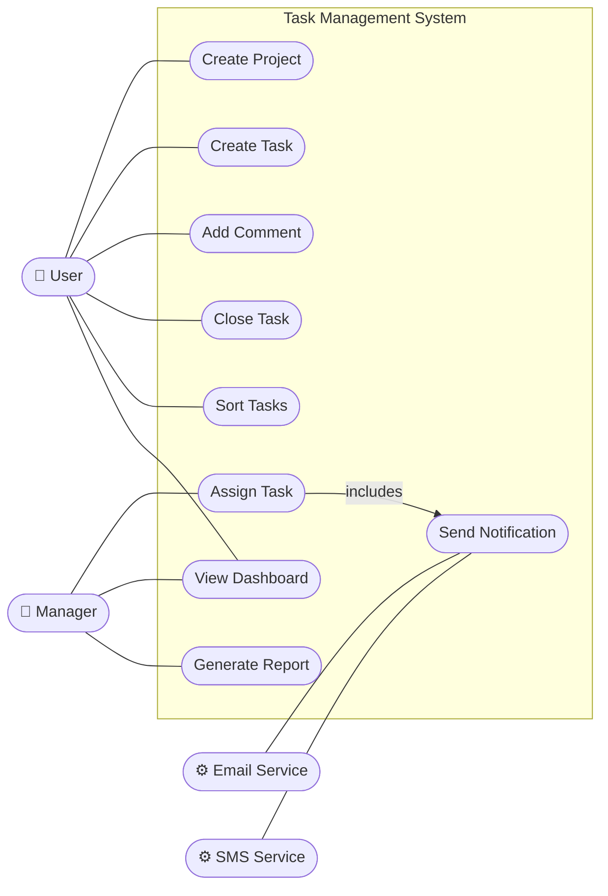
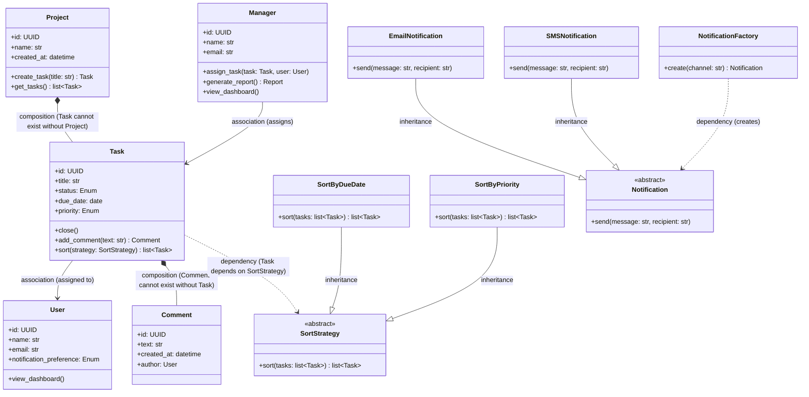
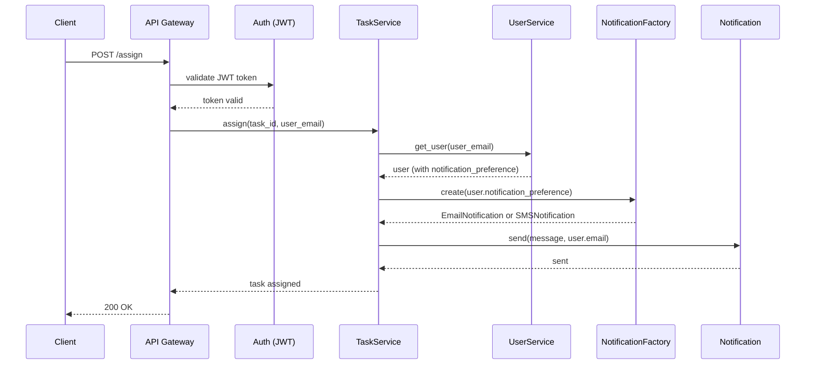
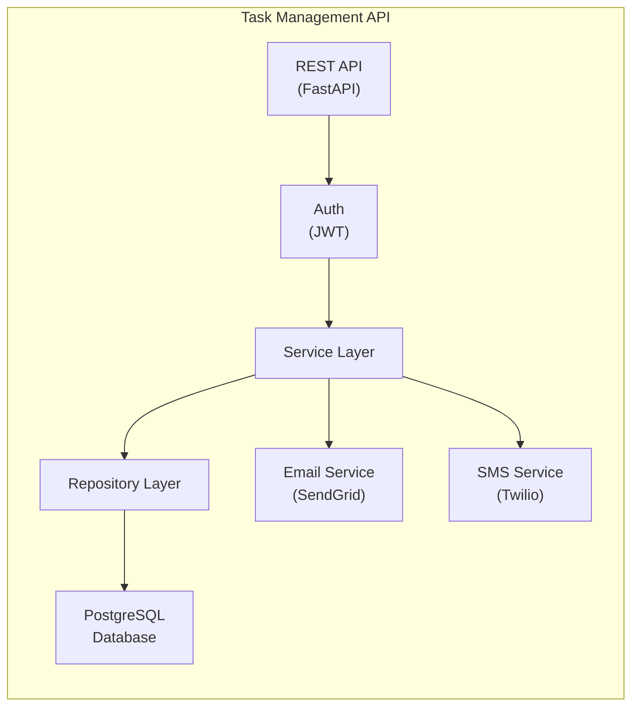
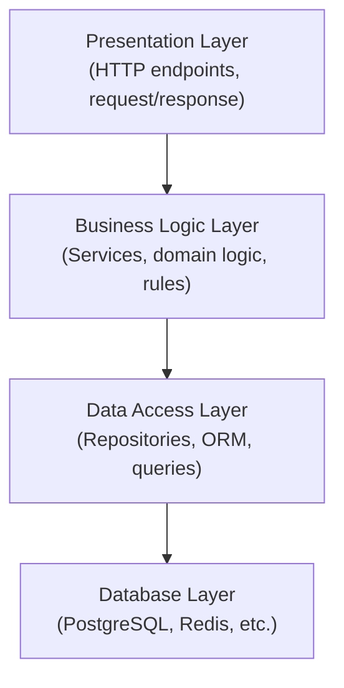
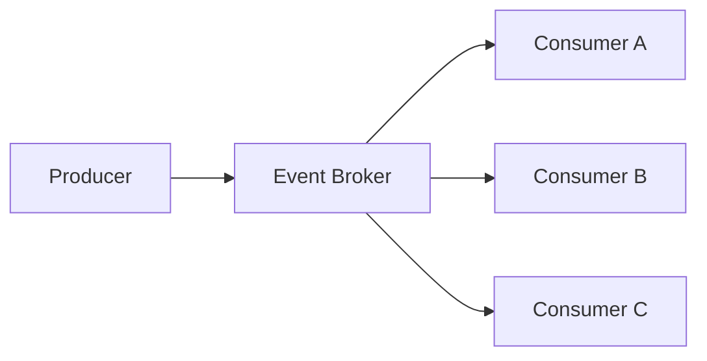
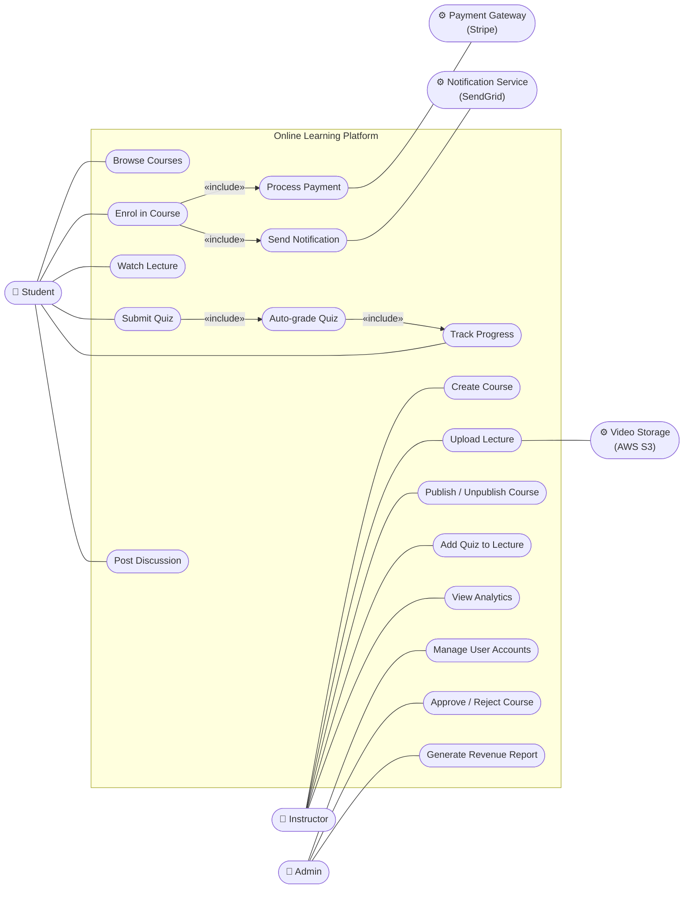
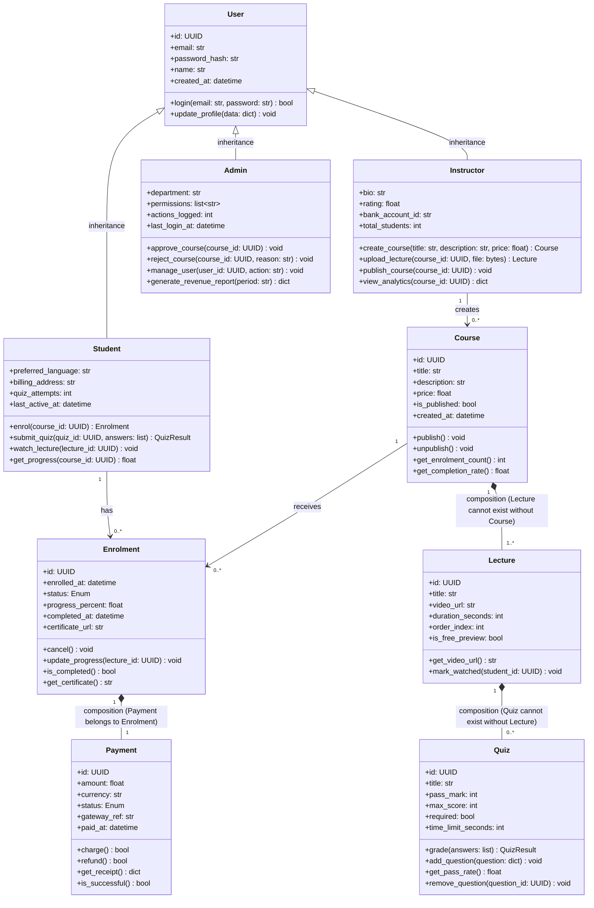
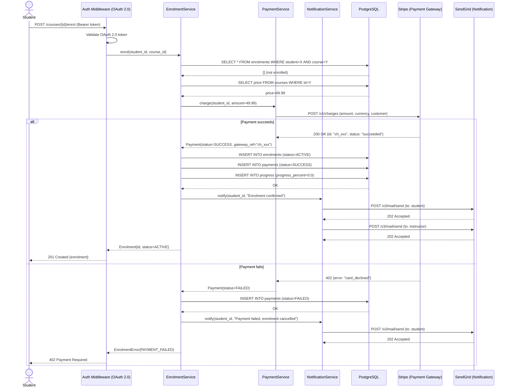
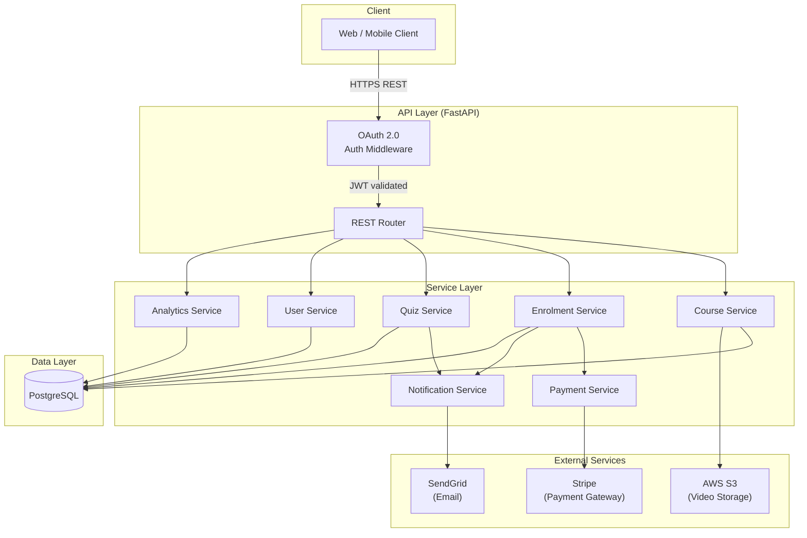

# Chapter 3: Software Design, Architecture, and Patterns

> *"A designer knows he has achieved perfection not when there is nothing left to add, but when there is nothing left to take away."*
> — Antoine de Saint-Exupéry

---

## Learning Objectives

By the end of this chapter, you will be able to:

1. Read and produce UML diagrams: use case, class, sequence, and component diagrams.
2. Compare and select appropriate architectural patterns for a given system.
3. Identify and apply common Gang of Four design patterns.
4. Apply SOLID principles and other design guidelines to produce maintainable code.
5. Write clean, readable Python code following established conventions.

---

## 3.1 Why Design Matters

Writing code that works is necessary but not sufficient. Code must also be maintainable — readable and modifiable by other developers (and by your future self) over months and years. Poor design decisions made early in a project compound over time: a monolithic module that is difficult to test becomes more difficult to test as it grows; a tangled dependency structure becomes harder to untangle as more code depends on it.

Software design is the activity of deciding *how* a system will be structured before (or alongside) the activity of writing code. Good design:

- Makes the system easier to understand
- Makes the system easier to test
- Makes the system easier to change in response to new requirements
- Reduces the risk of introducing bugs when modifying existing functionality

This chapter covers design at three levels:
1. **Diagrams**: visual representations of system structure and behaviour
2. **Architecture**: high-level decisions about system organisation
3. **Patterns**: proven solutions to recurring design problems

---

## 3.2 UML Diagrams

The Unified Modeling Language (UML) is a standardised notation for visualising software systems ([OMG, 2017](https://www.omg.org/spec/UML/2.5.1/)). It provides a shared vocabulary for communicating design decisions between developers, architects, and stakeholders.

We focus on four diagram types that are most commonly used in practice. To make each diagram concrete and comparable, all four examples in this section are drawn from the same system — a project management tool whose requirements are described in the scenario below. Read the scenario once, then refer back to it as you study each diagram type.

**Example — Project Management Tool:**

**Scenario:** A project management tool has two human actors — a **User** and a **Manager** — and two external system actors — an **Email Service** (SendGrid) and an **SMS Service** (Twilio). The system is built as a REST API using FastAPI, stores data in a **PostgreSQL** database, and requires all requests to be authenticated via JWT tokens before reaching the service layer. Users can create projects, create tasks within those projects, add comments to tasks, close tasks, sort tasks by different strategies (due date or priority), and view a shared dashboard. Managers can assign tasks to users, view the dashboard, and generate reports. Whenever a manager assigns a task, the system looks up the recipient's notification preference and automatically sends a notification through either SendGrid or Twilio.

### 3.2.1 Use Case Diagrams

Use case diagrams show the interactions between *actors* (users or external systems) and the *use cases* (features) a system provides. They communicate system scope at a high level and are useful for stakeholder communication early in a project.

**Elements:**
- **Actor**: A stick figure representing a user role or external system
- **Use case**: An oval representing a system function
- **Association**: A line connecting an actor to the use cases they participate in
- **System boundary**: A rectangle enclosing all use cases in scope

**Example — Task Management System:**

The use case diagram below maps the scenario's four actors to the nine features they interact with. Notice how `Assign Task` includes `Send Notification` — capturing the rule that every assignment automatically triggers a notification.



Use case diagrams intentionally omit implementation detail — they show *what* the system does, not *how*.

### 3.2.2 Class Diagrams

Class diagrams show the static structure of a system — the classes, their attributes and methods, and the relationships between them. They are the most widely used UML diagram type for communicating object-oriented design.

**Key relationships:**
- **Association**: A uses B (solid line)
- **Aggregation**: A has B, B can exist without A (hollow diamond)
- **Composition**: A contains B, B cannot exist without A (filled diamond)
- **Inheritance**: A is a B (hollow triangle arrow)
- **Interface implementation**: A implements B (dashed line with hollow triangle)
- **Dependency**: A depends on B (dashed arrow)


The class diagram below models the scenario described above, showing how each relationship type appears in a real domain. Notice how composition is used where an entity cannot exist independently, aggregation where it can, and the Factory Method pattern is used to decouple notification creation from its concrete implementations.



### 3.2.3 Sequence Diagrams

Sequence diagrams show how objects interact over time to accomplish a specific use case. They are valuable for documenting the flow of a complex operation, particularly when multiple components or services are involved.

**Example — Assigning a task:**

The sequence diagram below traces the `Assign Task` use case end-to-end, showing how the API Gateway validates the JWT token, how `TaskService` delegates user lookup and notification creation to dedicated services, and how the Factory Method pattern selects the correct channel at runtime.



### 3.2.4 Component Diagrams

Component diagrams show the high-level organisation of a system into components and their dependencies. They bridge the gap between architecture diagrams and class diagrams.

**Example — Task Management API components:**

The component diagram below shows how the system is decomposed into deployable components. Notice that all requests pass through the Auth component before reaching the Service Layer, and that the Service Layer fans out to both the Email and SMS external services — reflecting the two notification channels described in the scenario.



---

## 3.3 Architectural Patterns

An architectural pattern is a high-level strategy for organising the major components of a system. Selecting the right architectural pattern for a system's requirements is one of the most consequential decisions a software team makes — and one of the hardest to reverse.

### 3.3.1 Layered (N-Tier) Architecture

The layered pattern organises a system into horizontal layers, where each layer serves the layer above it and depends only on the layer below it ([Buschmann et al., 1996](https://www.wiley.com/en-us/Pattern+Oriented+Software+Architecture%2C+Volume+1%2C+A+System+of+Patterns-p-9780471958697)).



**Strengths:** Simple to understand; good separation of concerns; easy to test each layer independently.

**Weaknesses:** Can lead to "pass-through" layers that add no logic; performance overhead from passing data through many layers; tendency toward monolithic deployment.

**Suitable for:** Business applications, CRUD-heavy APIs, systems where the team is primarily familiar with this pattern.

### 3.3.2 Model-View-Controller (MVC)

MVC separates a system into three components ([Reenskaug, 1979](https://folk.universitetetioslo.no/trygver/themes/mvc/mvc-index.html)):

- **Model**: The data and business logic
- **View**: The presentation layer (what the user sees)
- **Controller**: Handles user input and coordinates Model and View

MVC is widely used in web frameworks: Django, Ruby on Rails, and Spring MVC all implement variants of this pattern.

### 3.3.3 Event-Driven Architecture

In an event-driven architecture, components communicate by producing and consuming events rather than calling each other directly. An *event broker* (such as Apache Kafka or RabbitMQ) decouples producers from consumers.



**Strengths:** High decoupling; components can scale independently; easy to add new consumers without modifying producers.

**Weaknesses:** Harder to reason about system state; distributed tracing is complex; eventual consistency requires careful handling.

**Suitable for:** High-throughput systems, microservices that need loose coupling, real-time notification systems, audit log pipelines.

### 3.3.4 Microservices

A microservices architecture decomposes a system into small, independently deployable services, each responsible for a single bounded domain ([Newman, 2015](https://www.oreilly.com/library/view/building-microservices/9781491950340/)). Each service has its own database and communicates with others via APIs or events.

**Strengths:** Services can be deployed, scaled, and rewritten independently; teams can work autonomously on separate services; fault isolation.

**Weaknesses:** Significant operational complexity (service discovery, distributed tracing, network latency, eventual consistency); not appropriate for small teams or early-stage products.

**Suitable for:** Large teams (multiple squads, each owning a service); systems where different components have very different scaling requirements.

### 3.3.5 Monolithic Architecture

A monolith is a single deployable unit containing all the system's functionality. Despite its reputation, a well-structured monolith is often the right choice for small teams and early-stage systems ([Fowler, 2015](https://martinfowler.com/bliki/MonolithFirst.html)).

**Strengths:** Simple to develop, test, and deploy; no network latency between components; easy to refactor across the codebase.

**Weaknesses:** Entire system must be redeployed for any change; scaling requires scaling the entire application; risk of components becoming tightly coupled over time.

**The "Monolith First" principle**: Start with a well-structured monolith. Extract services only when you have clear evidence that a specific component needs independent scaling or when team boundaries demand it.

---

## 3.4 Design Patterns (Gang of Four)

Design patterns are proven, reusable solutions to commonly occurring problems in software design ([Gamma et al., 1994](https://en.wikipedia.org/wiki/Design_Patterns)). The original catalog, published by the "Gang of Four" (GoF), describes 23 patterns in three categories:

- **Creational**: How objects are created
- **Structural**: How objects are composed
- **Behavioural**: How objects interact and distribute responsibility

We cover the patterns most commonly encountered in Python backend development.

### 3.4.1 Singleton (Creational)

Ensures a class has only one instance and provides a global access point to it.

**Use case**: Database connection pools, configuration objects, logging instances.

```python
# singleton.py
class DatabaseConnection:
    _instance: "DatabaseConnection | None" = None

    def __new__(cls) -> "DatabaseConnection":
        if cls._instance is None:
            cls._instance = super().__new__(cls)
            cls._instance._connect()
        return cls._instance

    def _connect(self) -> None:
        # Initialise the connection once
        self.connection = "connected"  # placeholder

    def query(self, sql: str) -> list:
        # Execute query using self.connection
        return []


# Both variables point to the same instance
db1 = DatabaseConnection()
db2 = DatabaseConnection()
assert db1 is db2  # True
```

**Caution**: Singletons introduce global state, which can make testing difficult. In Python, dependency injection (passing the instance explicitly) is often preferable.

### 3.4.2 Factory Method (Creational)

Defines an interface for creating objects but lets subclasses decide which class to instantiate.

**Use case**: Creating notification objects (email, SMS, push) based on user preference.

```python
# factory.py
from abc import ABC, abstractmethod


class Notification(ABC):
    @abstractmethod
    def send(self, message: str, recipient: str) -> None: ...


class EmailNotification(Notification):
    def send(self, message: str, recipient: str) -> None:
        print(f"Sending email to {recipient}: {message}")


class SMSNotification(Notification):
    def send(self, message: str, recipient: str) -> None:
        print(f"Sending SMS to {recipient}: {message}")


def create_notification(channel: str) -> Notification:
    """Factory function — returns the appropriate Notification subclass."""
    channels: dict[str, type[Notification]] = {
        "email": EmailNotification,
        "sms": SMSNotification,
    }
    if channel not in channels:
        raise ValueError(f"Unknown notification channel: {channel}")
    return channels[channel]()


# Usage
notifier = create_notification("email")
notifier.send("Your task has been assigned.", "alice@example.com")
```

### 3.4.3 Observer (Behavioural)

Defines a one-to-many dependency between objects so that when one object changes state, all its dependents are notified automatically.

**Use case**: Event systems, UI data binding, notification pipelines.

```python
# observer.py
from abc import ABC, abstractmethod


class EventListener(ABC):
    @abstractmethod
    def on_event(self, event: dict) -> None: ...


class TaskEventBus:
    def __init__(self) -> None:
        self._listeners: list[EventListener] = []

    def subscribe(self, listener: EventListener) -> None:
        self._listeners.append(listener)

    def publish(self, event: dict) -> None:
        for listener in self._listeners:
            listener.on_event(event)


class EmailNotifier(EventListener):
    def on_event(self, event: dict) -> None:
        if event.get("type") == "task_assigned":
            print(f"Email: task {event['task_id']} assigned to {event['assignee']}")


class AuditLogger(EventListener):
    def on_event(self, event: dict) -> None:
        print(f"Audit log: {event}")


# Usage
bus = TaskEventBus()
bus.subscribe(EmailNotifier())
bus.subscribe(AuditLogger())

bus.publish({"type": "task_assigned", "task_id": "123", "assignee": "alice"})
```

### 3.4.4 Strategy (Behavioural)

Defines a family of algorithms, encapsulates each one, and makes them interchangeable.

**Use case**: Sorting algorithms, payment processing, priority calculation.

```python
# strategy.py
from abc import ABC, abstractmethod
from dataclasses import dataclass
from datetime import date


@dataclass
class Task:
    id: str
    title: str
    due_date: date
    priority: int  # 1 (low) to 4 (critical)


class SortStrategy(ABC):
    @abstractmethod
    def sort(self, tasks: list[Task]) -> list[Task]: ...


class SortByDueDate(SortStrategy):
    def sort(self, tasks: list[Task]) -> list[Task]:
        return sorted(tasks, key=lambda t: t.due_date)


class SortByPriority(SortStrategy):
    def sort(self, tasks: list[Task]) -> list[Task]:
        return sorted(tasks, key=lambda t: t.priority, reverse=True)


class TaskList:
    def __init__(self, strategy: SortStrategy) -> None:
        self._strategy = strategy

    def set_strategy(self, strategy: SortStrategy) -> None:
        self._strategy = strategy

    def get_sorted(self, tasks: list[Task]) -> list[Task]:
        return self._strategy.sort(tasks)
```

### 3.4.5 Repository (Architectural Pattern)

While not in the original GoF catalog, the Repository pattern ([Fowler, 2002](https://martinfowler.com/eaaCatalog/repository.html)) is essential in modern backend development. It abstracts the data access layer, presenting a collection-like interface to the domain model.

```python
# repository.py
from abc import ABC, abstractmethod
from uuid import UUID
from dataclasses import dataclass
from datetime import date


@dataclass
class Task:
    id: UUID
    title: str
    due_date: date | None = None


class TaskRepository(ABC):
    """Abstract repository — defines the interface."""

    @abstractmethod
    def find_by_id(self, task_id: UUID) -> Task | None: ...

    @abstractmethod
    def find_all_by_project(self, project_id: UUID) -> list[Task]: ...

    @abstractmethod
    def save(self, task: Task) -> Task: ...

    @abstractmethod
    def delete(self, task_id: UUID) -> None: ...


class InMemoryTaskRepository(TaskRepository):
    """In-memory implementation — used in tests."""

    def __init__(self) -> None:
        self._store: dict[UUID, Task] = {}

    def find_by_id(self, task_id: UUID) -> Task | None:
        return self._store.get(task_id)

    def find_all_by_project(self, project_id: UUID) -> list[Task]:
        return list(self._store.values())  # simplified

    def save(self, task: Task) -> Task:
        self._store[task.id] = task
        return task

    def delete(self, task_id: UUID) -> None:
        self._store.pop(task_id, None)
```

The key benefit: services depend on the abstract `TaskRepository`, not on a specific database implementation. Swapping PostgreSQL for SQLite in tests requires only a different concrete class.

---

## 3.5 Design Principles

Design patterns tell you *what* to do in specific situations. Design principles tell you *how to think* about design in general. These principles have been distilled from decades of practical experience.

### 3.5.1 SOLID Principles

The SOLID principles ([Martin, 2000](https://web.archive.org/web/20150906155800/http://www.objectmentor.com/resources/articles/Principles_and_Patterns.pdf)) are five guidelines for writing maintainable object-oriented code:

**S — Single Responsibility Principle (SRP)**

> A class should have only one reason to change.

A class that handles HTTP parsing, business logic, *and* database queries will need to change whenever any of those three concerns changes. Separating them into different classes means each has one reason to change.

```python
# Violates SRP — this class does too much
class TaskService:
    def create_task(self, title: str, user_id: str) -> dict:
        # Business logic
        if not title.strip():
            raise ValueError("Title cannot be empty")
        # Database access (should be in repository)
        db.execute("INSERT INTO tasks ...")
        # Email sending (should be in notification service)
        smtp.send_email(user_id, "Task created")
        return {"id": "...", "title": title}
```

**O — Open/Closed Principle (OCP)**

> Software entities should be open for extension, but closed for modification.

You should be able to add new behaviour without modifying existing code. The Strategy pattern from Section 3.4.4 is a direct application of OCP: new sort strategies can be added without modifying `TaskList`.

**L — Liskov Substitution Principle (LSP)**

> Objects of a subclass should be substitutable for objects of the superclass without altering program correctness.

If `InMemoryTaskRepository` is a subclass of `TaskRepository`, any code that works with `TaskRepository` must work identically with `InMemoryTaskRepository`. Violating LSP typically indicates that the inheritance relationship is wrong.

**I — Interface Segregation Principle (ISP)**

> Clients should not be forced to depend on interfaces they do not use.

Rather than one large interface, prefer several small, focused ones. A `ReadOnlyTaskRepository` interface (with only `find_by_id` and `find_all`) is more appropriate for a reporting service than a full `TaskRepository` that includes `save` and `delete`.

**D — Dependency Inversion Principle (DIP)**

> High-level modules should not depend on low-level modules. Both should depend on abstractions.

```python
# Violates DIP — TaskService depends directly on the concrete PostgreSQL implementation
class TaskService:
    def __init__(self) -> None:
        self.repo = PostgresTaskRepository()  # concrete dependency

# Follows DIP — TaskService depends on the abstract interface
class TaskService:
    def __init__(self, repo: TaskRepository) -> None:
        self.repo = repo  # injected abstraction
```

This is *dependency injection* — the concrete implementation is passed in from outside, typically by an application container. It makes `TaskService` testable with `InMemoryTaskRepository`.

### 3.5.2 DRY: Don't Repeat Yourself

> Every piece of knowledge must have a single, unambiguous, authoritative representation within a system. ([Hunt & Thomas, 1999](https://pragprog.com/titles/tpp/the-pragmatic-programmer/))

Duplicated code is duplicated knowledge. When the logic changes (and it will), you must find and update every copy. The solution is not always to extract a function — sometimes the duplication is accidental and the two pieces of code will diverge. Use judgment: extract when the duplication represents the *same concept*, not just the same syntax.

### 3.5.3 Composition Over Inheritance

Prefer composing objects from smaller, focused components over building deep inheritance hierarchies. Inheritance creates tight coupling between parent and child; composition allows components to be mixed and matched.

### 3.5.4 Hollywood Principle

> "Don't call us, we'll call you."

High-level components should control when and how low-level components are used, not the reverse. This is the principle behind inversion of control (IoC) frameworks and the Observer pattern.

---

## 3.6 Clean Code

Clean code is code that is easy to read, understand, and modify ([Martin, 2008](https://www.oreilly.com/library/view/clean-code-a/9780136083238/)). It is not about aesthetics — it is about reducing the cognitive load on the next developer who reads it (who is often you, six months later).

### 3.6.1 Naming

Names should reveal intent. Avoid abbreviations, single-letter variables (except in well-established contexts like loop counters), and misleading names.

```python
# Poor naming
def proc(d: list, f: bool) -> list:
    r = []
    for i in d:
        if i["s"] == 1 or f:
            r.append(i)
    return r

# Clean naming
def get_active_tasks(tasks: list[dict], include_archived: bool = False) -> list[dict]:
    return [
        task for task in tasks
        if task["status"] == 1 or include_archived
    ]
```

### 3.6.2 Functions

Functions should do one thing and do it well. A function that can be described with "and" in its name (e.g., `validate_and_save_task`) is doing too much. Keep functions short — typically 5–20 lines. If a function is longer, it is probably doing more than one thing.

### 3.6.3 Comments

Write code that does not need comments. When a comment is necessary, explain *why*, not *what* — the code already shows what it does.

```python
# Poor comment — explains what the code does, which is obvious
# Loop through tasks and add them to the result list
result = [task for task in tasks if task.is_active()]

# Good comment — explains a non-obvious constraint
# Skip soft-deleted tasks: the UI shows these with a strikethrough
# but the API should not return them in list endpoints
result = [task for task in tasks if not task.deleted_at]
```

### 3.6.4 Code Structure and Style

Consistent structure and formatting reduce cognitive load. For Python, follow [PEP 8](https://peps.python.org/pep-0008/) — the official style guide — and use `ruff` (introduced in Chapter 1) to enforce it automatically.

Key conventions:
- 4-space indentation
- Maximum line length: 88–120 characters (team decision)
- Two blank lines between top-level definitions
- Type annotations on all function signatures (enforced by `mypy`)

---

## 3.7 Tutorial Activity: Design a System from Requirements

### Background

Reading diagrams is a passive skill; drawing them under constraint is where the learning happens. In this activity you are given a written requirement scenario — the kind you might receive from a product manager or a client — and asked to produce all four UML diagram types covered in this chapter: use case, class, sequence, and component. Each diagram forces a different design question: who interacts with the system, how the domain is structured, how a key flow unfolds at runtime, and how the components are wired together. Because all four diagrams describe the same system, inconsistencies between them are immediately visible and must be resolved — mirroring the design review process in professional practice.

The scenario is intentionally more complex than the chapter examples, requiring you to make judgment calls about actor boundaries, relationship types, and component responsibilities. There is no single correct answer, but every choice must be defensible against the scenario text.

### Part 1 — Diagram Creation (25 min)

Read the scenario below and draw all four UML diagram types covered in Section 3.2. Each diagram must be consistent with the others — the same actors, classes, and components should appear across all four.

---

**Scenario — Online Learning Platform:**

An online learning platform has three human actors — a **Student**, an **Instructor**, and an **Admin** — and three external system actors — a **Payment Gateway** (Stripe), a **Video Storage Service** (AWS S3), and a **Notification Service** (SendGrid). The system is built as a REST API using FastAPI, stores data in a PostgreSQL database, and requires all requests to be authenticated via OAuth 2.0 tokens before reaching the service layer.

Instructors can create courses, upload video lectures to AWS S3, publish or unpublish courses, add quizzes to lectures, and view an analytics dashboard showing enrolment and completion rates. Students can browse published courses, enrol in a course by paying through Stripe, watch lectures, submit quiz answers, track their progress, and post questions in a course discussion thread. Admins can manage user accounts, approve or reject courses submitted for review, and generate platform-wide revenue reports.

Whenever a student enrols in a course, the system charges the student via Stripe and — if payment succeeds — sends a confirmation notification through SendGrid. If payment fails, the enrolment is cancelled and the student is notified. Instructors are also notified via SendGrid whenever a student enrols in one of their courses. Quiz submissions are automatically graded; students receive their result immediately and their progress record is updated. Course progress is calculated as the percentage of lectures watched and quizzes passed.

---

Read the scenario below and draw all four UML diagram types covered in Section 3.2. Each diagram must be consistent with the others — the same actors, classes, and components should appear across all four.


**Tasks:**

1. **(Use Case Diagram)** Draw a use case diagram showing all actors, all use cases within the system boundary, and at least two `<<include>>` or `<<extend>>` relationships. Justify each relationship in one sentence.

2. **(Class Diagram)** Draw a class diagram for the core domain. Include at least: `Course`, `Lecture`, `Quiz`, `Enrolment`, `Student`, `Instructor`, `Admin`, `Payment`. Show correct relationship types (composition, aggregation, association, inheritance, dependency) with multiplicity on each end. Add at least four attributes and two methods to each class.

3. **(Sequence Diagram)** Draw a sequence diagram for the **Enrol in Course** use case, tracing the full flow from the student's HTTP request through payment, notification, and progress initialisation.

4. **(Component Diagram)** Draw a component diagram showing all internal components and their dependencies, including the three external services. Show the auth layer explicitly.

**After completing all four diagrams:** Check that the participants in your sequence diagram match classes in your class diagram, and that the components in your component diagram correspond to the layers implied by your class diagram. Note any inconsistencies and explain how you would resolve them.

<details>
<summary>Click to reveal sample answer.</summary>

**Diagram 1 — Use Case Diagram**

> Mermaid has no native use-case diagram type; the flowchart below encodes the same information using rounded shapes for actors, rectangles for use cases inside the system boundary, and labelled arrows for `«include»` relationships.



**Relationship justifications:**
- `Enrol in Course` **«include»** `Process Payment`: every enrolment unconditionally triggers a Stripe charge — payment is mandatory, not optional.
- `Enrol in Course` **«include»** `Send Notification`: on every enrolment outcome (success or failure) a SendGrid email is sent — notification is part of the enrolment contract.
- `Submit Quiz` **«include»** `Auto-grade Quiz`: every quiz submission unconditionally triggers automatic grading — students always receive their result immediately.
- `Auto-grade Quiz` **«include»** `Track Progress`: every graded quiz unconditionally updates the student's progress percentage — progress is always recalculated after a quiz result.

---

**Diagram 2 — Class Diagram**



---

**Diagram 3 — Sequence Diagram: Enrol in Course**



---

**Diagram 4 — Component Diagram**



---

</details>

---

### Part 2 — Architecture Decision (20 min)

Read each scenario below and select the most appropriate architectural pattern from Section 3.3. Write a two-sentence justification for your choice.

| Scenario | System description |
|---|---|
| **A** | A 2-person startup building a task management MVP with a 3-month deadline and no existing infrastructure. |
| **B** | A 500-person enterprise replacing a legacy task tracking platform, with 8 independent product teams each owning a separate domain. |
| **C** | A real-time task notification system that must process 100,000 events per minute and fan out to email, SMS, and audit log consumers. |

Once you have written your justifications, compare with another group. Where you disagree, argue your case — both sides should be able to defend their choice using the strengths and weaknesses listed in the chapter.

> **Hint:** There is no single correct answer for every scenario, but some choices are much harder to defend than others.

<details>
<summary>Click to reveal sample answer.</summary>

**Scenario A → Monolith**
Small team, tight deadline, no existing infrastructure. A monolith is simple to develop, test, and deploy in a single step. Microservices or event-driven would introduce operational complexity — service discovery, distributed tracing, network latency — that a 2-person team cannot absorb. Apply the "Monolith First" principle from Section 3.3.5.

**Scenario B → Microservices**
Eight independent teams each owning a separate domain maps directly to the microservices model: each team deploys their service independently, owns its database, and cannot break other teams' releases. The significant operational overhead is justified because the organisational structure demands it (Section 3.3.4).

**Scenario C → Event-Driven Architecture**
High-throughput fan-out to multiple consumers (email, SMS, audit log) is the textbook event-driven use case. Producers publish to a broker; each consumer subscribes and scales independently. Synchronous direct calls at 100,000 events/minute would create tight coupling and bottlenecks (Section 3.3.3).

**Defensible alternatives:**
- Scenario A: Layered/MVC is also acceptable — it is a structured monolith. The key argument to reject is microservices.
- Scenario B: A layered monolith can be defended if teams are co-located and domains are not truly independent, but it is the harder argument.
- Scenario C: Microservices with synchronous APIs would require queueing infrastructure to handle this throughput — which is effectively event-driven anyway.

</details>

---

### Part 3 — Design Pattern Analysis (40 min)

The following code is taken from a broken codebase. Read it carefully and annotate every problem you find, labelling each one with the relevant principle or pattern name from Sections 3.4 and 3.5.

```python
# task_service.py
import smtplib
import psycopg2


class TaskService:
    def __init__(self):
        self.conn = psycopg2.connect("host=localhost dbname=tasks")    # (?)

    def process(self, t, f, uid):                                      # (?)
        if t == "" or t == None:                                       # (?)
            print("bad title")
            return None
        cur = self.conn.cursor()
        cur.execute(f"INSERT INTO tasks VALUES ('{t}', '{uid}')")      # (?)
        self.conn.commit()
        smtp = smtplib.SMTP('smtp.gmail.com')                          # (?)
        smtp.sendmail('app@co.com', uid, f'Task {t} created')
        if f == True:                                                  # (?)
            cur.execute(f"SELECT * FROM tasks WHERE uid='{uid}'")
            return cur.fetchall()
        return {"title": t, "user": uid}

    def process(self, tasks, reverse):                                 # (?)
        if reverse == True:
            return sorted(tasks, key=lambda x: x['date'], reverse=True)
        else:
            return sorted(tasks, key=lambda x: x['date'])
```

Replace each `(?)` marker with the name of the violation (e.g., *SRP violation*, *DIP violation*, *poor naming*).

<details>
<summary>Click to reveal sample answer.</summary>

| Marker | Violation |
|---|---|
| Line 7 | DIP — `TaskService` directly instantiates a concrete `psycopg2` connection rather than accepting an injected abstraction |
| Line 10 | Clean Code / naming — `process`, `t`, `f`, `uid` reveal no intent |
| Line 11 | Clean Code — `t == None` should be `t is None`; the empty-string check is a separate concern |
| Lines 13–14 | Security — SQL injection via f-string interpolation |
| Lines 15–16 | SRP — email sending belongs in a dedicated notification service, not in `TaskService` |
| Line 17 | Clean Code — `if f == True` should be `if f` |
| Lines 20–23 | OCP + Strategy — sorting logic is hardcoded; new sort orders require modifying this class. Also, the duplicate method name silently shadows the first `process` method |

**Sub-task (15 min):** Rewrite `__init__` and the first `process` method to fix the DIP, SRP, and naming violations. You do not need a full working implementation — correct method signatures, type annotations, and injected dependencies are sufficient. 
</detail>

---

### Part 4 — Clean Code Refactor (25 min)

Refactor the following function in two rounds.

```python
def proc(d, f, x):
    r = []
    for i in d:
        if i[2] == 1:
            if f:
                r.append(i)
            elif i[3] <= x:
                r.append(i)
    return r
```

**Round 1 — Rename only (10 min):**
- Give the function and all parameters meaningful names
- Add type annotations to the signature
- Add one comment where it is genuinely needed (explain *why*, not *what*)
- Do not change any logic

**Round 2 — Restructure (15 min):**
- Flatten the nested `if` statements
- Replace the loop with a list comprehension if it improves clarity
- Extract any implicit concept (e.g., the condition `i[2] == 1`) into a named variable or helper

Swap your refactored code with another pair and critique their naming choices. Would a new developer understand the function's intent from the name and signature alone, without reading the body?

---
