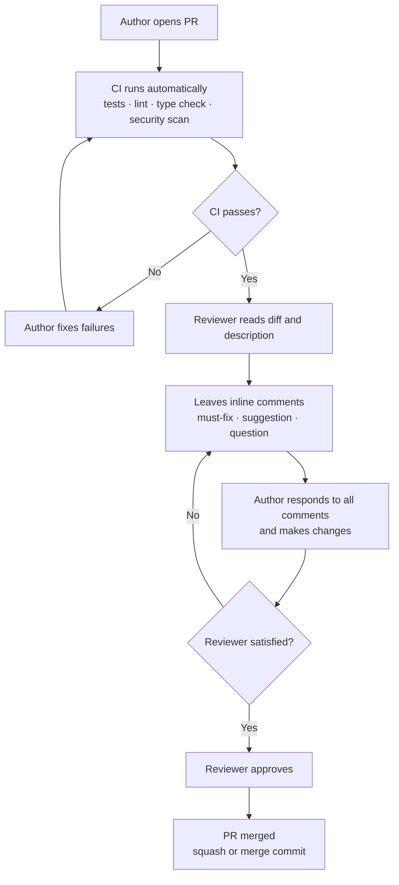

# Chapter 4: Software Testing, Code Quality, Code Review, and CI/CD

> *"Testing shows the presence, not the absence of bugs."*
> — Edsger W. Dijkstra

---

## Learning Objectives

By the end of this chapter, you will be able to:

1. Explain the different levels of software testing and when to apply each.
2. Write unit tests and integration tests in Python using pytest.
3. Measure and interpret code coverage and understand its limitations.
4. Configure a CI/CD pipeline using GitHub Actions.
5. Apply static analysis and code review techniques to catch defects early.
6. Critically evaluate AI-generated tests and understand why AI cannot replace a thoughtful testing strategy.

---

## 4.1 Why Testing Matters

Software testing is the process of executing software with the intent of finding defects. It is not an optional step at the end of development — it is a discipline that runs throughout the entire software development lifecycle.

Testing serves several purposes:

- **Defect detection**: Finding bugs before they reach users
- **Regression prevention**: Ensuring that new changes do not break existing functionality
- **Design feedback**: Tests that are hard to write often indicate design problems
- **Documentation**: A well-named test suite describes exactly what a system does
- **Confidence**: A passing test suite gives the team confidence to make changes

The question is not whether to test, but *how* to test effectively given limited time and resources.

---

## 4.2 The Testing Pyramid

The *testing pyramid* ([Cohn, 2009](https://www.mountaingoatsoftware.com/books/succeeding-with-agile-software-development-using-scrum)) describes the ideal distribution of test types:

```
          ┌───────────┐
          │   E2E /   │   Few, slow, fragile — test critical paths only
          │ UI Tests  │
         ┌┴───────────┴┐
         │ Integration  │  Some — test component interactions
         │    Tests     │
        ┌┴──────────────┴┐
        │   Unit Tests    │  Many — fast, isolated, precise
        └────────────────┘
```

**Unit tests** are the foundation: fast, isolated, numerous. They test individual functions or classes in isolation.

**Integration tests** verify that components work correctly together — services calling repositories, API handlers interacting with business logic.

**End-to-end (E2E) tests** exercise the system as a whole, simulating real user interactions. They are slow, brittle, and expensive to maintain — use them sparingly, for critical user journeys only.

This distribution is sometimes called the "1:10:100 rule" — for every E2E test, write ~10 integration tests and ~100 unit tests. The exact ratio varies by system, but the principle holds: favour fast, isolated tests over slow, coupled ones.

---

## 4.3 Black-Box and White-Box Testing

Testing approaches can be categorised by how much knowledge of the internal implementation the tester uses.

### 4.3.1 Black-Box Testing

In black-box testing, the tester has no knowledge of the internal implementation. Tests are derived entirely from the specification — inputs are provided and outputs are verified against expected behaviour.

**Advantages**: Tests are specification-driven; a new implementation can be tested without modifying the tests; tests reflect user-visible behaviour.

**Techniques:**
- **Equivalence partitioning**: Divide inputs into classes that the system should handle identically. Test one representative from each class.
- **Boundary value analysis**: Test at the boundaries of valid input ranges. Bugs cluster at boundaries (off-by-one errors, empty inputs, maximum values).
- **Decision table testing**: For systems with complex conditional logic, enumerate all combinations of conditions and expected outcomes.

**Example — equivalence partitioning for task priority:**

The system accepts priority values 1–4. Partitions:
- **Valid**: 1, 2, 3, 4
- **Below range**: 0, -1
- **Above range**: 5, 100
- **Non-integer**: "high", 2.5, None

Test one value from each partition: `priority=2` (valid), `priority=0` (below), `priority=5` (above), `priority="high"` (non-integer).

### 4.3.2 White-Box Testing

In white-box testing (also called structural or glass-box testing), the tester has full knowledge of the internal implementation. Tests are derived from the source code, with the goal of exercising specific paths, branches, and conditions.

**Techniques:**
- **Statement coverage**: Every statement is executed by at least one test
- **Branch coverage**: Every branch (if/else, loop) is executed in both directions
- **Path coverage**: Every possible path through the code is executed (often infeasible for complex code)

White-box testing is particularly valuable for finding dead code, unreachable branches, and logic errors that black-box tests might miss.

---

## 4.4 Unit Testing with pytest

Unit tests verify the behaviour of a single unit of code — typically a function or method — in isolation from its dependencies.

### 4.4.1 Writing Your First Tests

```python
# src/task_service.py
from dataclasses import dataclass
from datetime import date
from uuid import UUID, uuid4


class TaskValidationError(ValueError):
    pass


@dataclass
class Task:
    id: UUID
    title: str
    priority: int  # 1–4
    due_date: date | None = None
    status: str = "open"


def create_task(title: str, priority: int, due_date: date | None = None) -> Task:
    """Create a new task with validation."""
    if not title or not title.strip():
        raise TaskValidationError("Title cannot be empty")
    if priority not in range(1, 5):
        raise TaskValidationError(f"Priority must be 1–4, got {priority}")
    if due_date and due_date < date.today():
        raise TaskValidationError("Due date cannot be in the past")
    return Task(id=uuid4(), title=title.strip(), priority=priority, due_date=due_date)
```

```python
# tests/test_task_service.py
import pytest
from datetime import date, timedelta
from src.task_service import create_task, TaskValidationError


class TestCreateTask:
    def test_creates_task_with_valid_inputs(self) -> None:
        task = create_task("Write tests", priority=2)
        assert task.title == "Write tests"
        assert task.priority == 2
        assert task.status == "open"
        assert task.id is not None

    def test_strips_whitespace_from_title(self) -> None:
        task = create_task("  Write tests  ", priority=1)
        assert task.title == "Write tests"

    def test_raises_for_empty_title(self) -> None:
        with pytest.raises(TaskValidationError, match="Title cannot be empty"):
            create_task("", priority=1)

    def test_raises_for_whitespace_only_title(self) -> None:
        with pytest.raises(TaskValidationError):
            create_task("   ", priority=1)

    @pytest.mark.parametrize("priority", [0, -1, 5, 100])
    def test_raises_for_invalid_priority(self, priority: int) -> None:
        with pytest.raises(TaskValidationError, match="Priority must be 1–4"):
            create_task("Valid title", priority=priority)

    @pytest.mark.parametrize("priority", [1, 2, 3, 4])
    def test_accepts_valid_priorities(self, priority: int) -> None:
        task = create_task("Valid title", priority=priority)
        assert task.priority == priority

    def test_raises_for_past_due_date(self) -> None:
        yesterday = date.today() - timedelta(days=1)
        with pytest.raises(TaskValidationError, match="Due date cannot be in the past"):
            create_task("Valid title", priority=1, due_date=yesterday)

    def test_accepts_future_due_date(self) -> None:
        tomorrow = date.today() + timedelta(days=1)
        task = create_task("Valid title", priority=1, due_date=tomorrow)
        assert task.due_date == tomorrow

    def test_accepts_no_due_date(self) -> None:
        task = create_task("Valid title", priority=1)
        assert task.due_date is None
```

Run the tests:

```bash
pytest tests/test_task_service.py -v
```

### 4.4.2 Fixtures

Fixtures are reusable setup functions that provide test dependencies. They replace repetitive setup code and enable dependency injection in tests.

```python
# tests/conftest.py
import pytest
from uuid import uuid4
from datetime import date, timedelta
from src.task_service import Task
from src.repository import InMemoryTaskRepository


@pytest.fixture
def repository() -> InMemoryTaskRepository:
    return InMemoryTaskRepository()


@pytest.fixture
def sample_task() -> Task:
    return Task(
        id=uuid4(),
        title="Sample task",
        priority=2,
        due_date=date.today() + timedelta(days=7),
    )
```

```python
# tests/test_repository.py
from uuid import uuid4
from src.task_service import Task
from src.repository import InMemoryTaskRepository


def test_save_and_retrieve_task(
    repository: InMemoryTaskRepository, sample_task: Task
) -> None:
    repository.save(sample_task)
    retrieved = repository.find_by_id(sample_task.id)
    assert retrieved == sample_task


def test_returns_none_for_missing_task(repository: InMemoryTaskRepository) -> None:
    result = repository.find_by_id(uuid4())
    assert result is None


def test_delete_removes_task(
    repository: InMemoryTaskRepository, sample_task: Task
) -> None:
    repository.save(sample_task)
    repository.delete(sample_task.id)
    assert repository.find_by_id(sample_task.id) is None
```

### 4.4.3 Mocking

When a unit under test depends on external systems (databases, email services, APIs), mocking replaces those dependencies with controlled substitutes.

```python
# tests/test_assignment_service.py
from unittest.mock import MagicMock, patch
from uuid import uuid4
from src.assignment_service import AssignmentService
from src.task_service import Task


def test_assign_task_sends_notification() -> None:
    # Arrange
    mock_repo = MagicMock()
    mock_notifier = MagicMock()
    service = AssignmentService(repo=mock_repo, notifier=mock_notifier)

    task_id = uuid4()
    mock_repo.find_by_id.return_value = Task(
        id=task_id, title="Test task", priority=1
    )

    # Act
    service.assign(task_id=task_id, assignee_email="alice@example.com")

    # Assert
    mock_repo.save.assert_called_once()
    mock_notifier.notify.assert_called_once_with(
        recipient="alice@example.com",
        subject="You have been assigned a task",
    )
```

---

## 4.5 Code Coverage

Code coverage measures how much of your source code is executed by your test suite. It is a useful indicator of untested areas, but it is not a measure of test quality.

```bash
pip install pytest-cov
pytest tests/ --cov=src --cov-report=term-missing
```

Sample output:
```
Name                      Stmts   Miss  Cover   Missing
---------------------------------------------------------
src/task_service.py          18      2    89%   34-35
src/repository.py            22      0   100%
src/assignment_service.py    15      3    80%   28, 41-42
---------------------------------------------------------
TOTAL                        55      5    91%
```

The `Missing` column shows which lines are not covered — useful for targeting additional tests.

**Coverage targets**: 80% is a common minimum threshold for production code. 100% coverage is neither necessary nor sufficient — you can have 100% coverage with tests that make no meaningful assertions.

**What coverage cannot tell you**:
- Whether the tests assert the *right* things
- Whether edge cases are tested (a line can be covered by a single happy-path test)
- Whether the system behaves correctly at the integration level

---

## 4.6 Code Quality and Static Analysis

Beyond testing, several automated tools catch quality issues before code review.

### 4.6.1 Linting with Ruff

Ruff (introduced in Chapter 1) enforces style rules and catches common programming errors:

```bash
ruff check src/
ruff format src/
```

Ruff subsumes the functionality of flake8, isort, and black, and is significantly faster than any of them individually.

### 4.6.2 Type Checking with mypy

Type annotations in Python (since PEP 484, [van Rossum et al., 2015](https://peps.python.org/pep-0484/)) enable static analysis. mypy verifies that type annotations are consistent throughout the codebase, catching a class of bugs that tests can miss.

```bash
mypy src/ --strict
```

Common errors mypy catches:
- Passing `None` where a non-optional value is expected
- Calling a method that does not exist on a type
- Returning the wrong type from a function
- Missing return statements

### 4.6.3 Security Scanning with Bandit

Bandit ([PyCQA, 2014](https://bandit.readthedocs.io/en/latest/)) scans Python code for common security vulnerabilities:

```bash
pip install bandit
bandit -r src/
```

Bandit flags issues like SQL injection risks, hardcoded passwords, use of weak cryptographic algorithms, and unsafe deserialization. Security scanning is covered in depth in Chapter 9.

---

## 4.7 Pull Requests and Code Review

Before code reaches the main branch, it passes through two gates: a *pull request* (PR), which is the mechanism for proposing and discussing a change, and *code review*, which is the human evaluation of that change. Together they are among the most effective defect-detection and knowledge-sharing practices in software engineering ([Fagan, 1976](https://ieeexplore.ieee.org/document/1702601); [Rigby & Bird, 2013](https://dl.acm.org/doi/10.1145/2491411.2491428)).

### 4.7.1 What Is a Pull Request?

A pull request is a request to merge a set of commits from one branch into another — typically from a feature branch into `main`. It serves as a structured checkpoint that combines:

- **Change visibility**: a diff showing exactly what changed and why
- **Discussion space**: a thread where reviewers can ask questions, raise concerns, and suggest improvements
- **Automated gate**: a trigger for CI checks (tests, linting, security scans) that must pass before merging
- **Audit trail**: a permanent record of what was changed, who reviewed it, and what was discussed

PRs are not just a technical mechanism — they are a communication artefact. A well-written PR description gives reviewers the context they need to evaluate the change without having to reconstruct it from the diff.

### 4.7.2 Why Pull Requests Matter

Without a PR discipline, several things tend to go wrong:

- **Bugs accumulate**: changes that look correct in isolation often reveal problems only when another developer reads them with fresh eyes
- **Knowledge silos form**: when code is never reviewed, only the author understands it
- **Standards drift**: without a review gate, style, architecture, and quality standards erode incrementally
- **Security vulnerabilities ship**: many common vulnerabilities (injection, broken auth, unsafe defaults) are easy to catch in review and expensive to fix in production

The PR process imposes a small cost per change — typically 30–60 minutes of reviewer time — in exchange for substantially lower defect rates and better collective code ownership.

### 4.7.3 Writing an Effective Pull Request

A good PR is small, focused, and self-explanatory. The title and description should answer three questions:

1. **What changed?** — a one-line summary that a reader can understand without opening the diff
2. **Why?** — the motivation: the bug being fixed, the requirement being met, the tech debt being addressed
3. **How should reviewers test it?** — the steps to verify the change works as intended

```markdown
## What
Add pagination to the task list endpoint (`GET /tasks`).

## Why
The endpoint currently returns all tasks in a single response. With >10,000 tasks 
in staging, response times exceed 5 s and memory usage spikes. Fixes #142.

## How to test
1. Run `pytest tests/test_task_endpoint.py -k pagination`
2. Manually: `curl "localhost:8000/tasks?page=2&page_size=20"` — should return 
   tasks 21–40 with `X-Total-Count` header set correctly.
3. Edge case: `page=0` should return HTTP 422.
```

**Keep PRs small.** A PR touching 10 files is reviewed carefully; a PR touching 50 files is rubber-stamped. Aim for changes that can be reviewed in under 20 minutes. If a feature requires large changes, break it into sequential PRs: data model first, then business logic, then API layer.

### 4.7.4 The Code Review Process

Code review is the practice of having another developer read and evaluate your code before it is merged. A standard review cycle proceeds as follows:



### 4.7.5 What to Look for in a Code Review

An effective reviewer checks:

- **Correctness**: Does the code do what the description claims? Are there edge cases the author missed?
- **Tests**: Are there sufficient tests? Do they cover the important cases, not just the happy path?
- **Design**: Does the change fit the existing architecture? Does it introduce unnecessary coupling or complexity?
- **Security**: Does the change introduce any security vulnerabilities? (See Chapter 5.)
- **Readability**: Can you understand the code without asking the author?
- **Performance**: Are there obvious performance issues — N+1 queries, unbounded loops, unnecessary allocations?

Reviewers are not responsible for finding every bug — that is what tests are for. The goal is a second pair of eyes that catches what the author's familiarity with their own code conceals.

### 4.7.6 Code Review Etiquette

Effective code review requires clear, respectful communication:

- Review the code, not the person: "This function is hard to follow" not "You wrote this poorly"
- Be specific: "Line 42: extracting this into a helper function would make it easier to test" not "this is messy"
- Distinguish must-fix from suggestions: prefix non-blocking suggestions with "nit:" or "optional:"
- Respond to all review comments, even briefly: "agreed, fixed" or "I disagree because X — open to discussion"
- Approve when it is good enough to ship, not when it is perfect

### 4.7.7 Automated Code Review

AI-powered tools (GitHub Copilot code review, CodeRabbit, Sourcery) can perform a first-pass review, catching mechanical issues before human reviewers see the code. These tools are most effective at:

- Identifying obvious bugs and null pointer issues
- Suggesting more idiomatic patterns
- Flagging inconsistency with the surrounding codebase
- Checking for common security anti-patterns

They are least effective at:
- Understanding business context and domain logic
- Evaluating architectural decisions
- Catching subtle security vulnerabilities that require domain knowledge
- Judging whether a change is the *right* change

Use automated review as a pre-filter, not a replacement for human review. Run it before the human reviewer sees the PR so reviewers can focus on what tools cannot catch.

---

## 4.8 Continuous Integration and Continuous Delivery (CI/CD)

Continuous integration (CI) is the practice of merging all developer branches into the main branch frequently — at least daily — with each merge triggering an automated build and test run ([Fowler, 2006](https://martinfowler.com/articles/continuousIntegration.html)).

Continuous delivery (CD) extends CI to ensure that the software is always in a deployable state. Every passing build is a release candidate.

### 4.8.1 GitHub Actions

GitHub Actions is a CI/CD platform built into GitHub. Workflows are defined as YAML files in `.github/workflows/`.

```yaml
# .github/workflows/ci.yml
name: CI

on:
  push:
    branches: [main]
  pull_request:
    branches: [main]

jobs:
  test:
    runs-on: ubuntu-latest

    steps:
      - name: Checkout code
        uses: actions/checkout@v4

      - name: Set up Python
        uses: actions/setup-python@v5
        with:
          python-version: "3.11"

      - name: Install dependencies
        run: |
          python -m pip install --upgrade pip
          pip install -r requirements.txt

      - name: Run linter
        run: ruff check src/ tests/

      - name: Run type checker
        run: mypy src/ --strict

      - name: Run tests with coverage
        run: pytest tests/ --cov=src --cov-report=xml --cov-fail-under=80

      - name: Run security scan
        run: bandit -r src/ -ll

      - name: Upload coverage report
        uses: codecov/codecov-action@v4
        with:
          file: ./coverage.xml
```

This workflow runs on every push to `main` and on every pull request. It will fail if:
- The linter finds any issues
- The type checker finds any errors
- Any test fails
- Code coverage drops below 80%
- Bandit finds any medium or higher severity issues

A failing CI pipeline blocks the pull request from being merged, enforcing quality standards automatically.

### 4.8.2 Branch Protection

Configuring branch protection ensures no code reaches the main branch without passing all automated checks.

**GitHub**

1. Repository Settings → Branches → Branch protection rules
2. Add a rule for `main`
3. Enable: "Require status checks to pass before merging"
4. Select the CI workflow checks
5. Optionally enable "Require approvals" to enforce peer review before merge

**GitLab**

1. Settings → Repository → Protected Branches
2. Add `main` as a protected branch
3. Set "Allowed to merge" to *Maintainers* (or your team's policy)
4. Set "Allowed to push" to *No one* to prevent direct pushes
5. Navigate to Settings → CI/CD → General pipelines and enable "Pipelines must succeed" under Merge Requests
6. Optionally set "Require approval from code owners" under Settings → Merge Requests

---

## 4.9 Tutorial: Full Testing and CI Setup for the Course Project

### Project Structure

```
online-shopping/
├── src/
│   ├── __init__.py
│   ├── task_service.py
│   ├── repository.py
│   └── assignment_service.py
├── tests/
│   ├── __init__.py
│   ├── conftest.py
│   ├── test_task_service.py
│   ├── test_repository.py
│   └── test_assignment_service.py
├── .github/
│   └── workflows/
│       └── ci.yml
├── pyproject.toml
├── requirements.txt
└── .pre-commit-config.yaml
```

### Running the Full Quality Suite Locally

```bash
# Run all checks in order
ruff check src/ tests/          # Linting
ruff format --check src/ tests/ # Formatting
mypy src/ --strict              # Type checking
pytest tests/ -v --cov=src \
  --cov-report=term-missing \
  --cov-fail-under=80           # Tests + coverage
bandit -r src/ -ll              # Security scan
```

Add a `Makefile` to run all checks with one command:

```makefile
# Makefile
.PHONY: check test lint typecheck security

check: lint typecheck test security

lint:
	ruff check src/ tests/
	ruff format --check src/ tests/

typecheck:
	mypy src/ --strict

test:
	pytest tests/ -v --cov=src --cov-report=term-missing --cov-fail-under=80

security:
	bandit -r src/ -ll
```

```bash
make check
```

