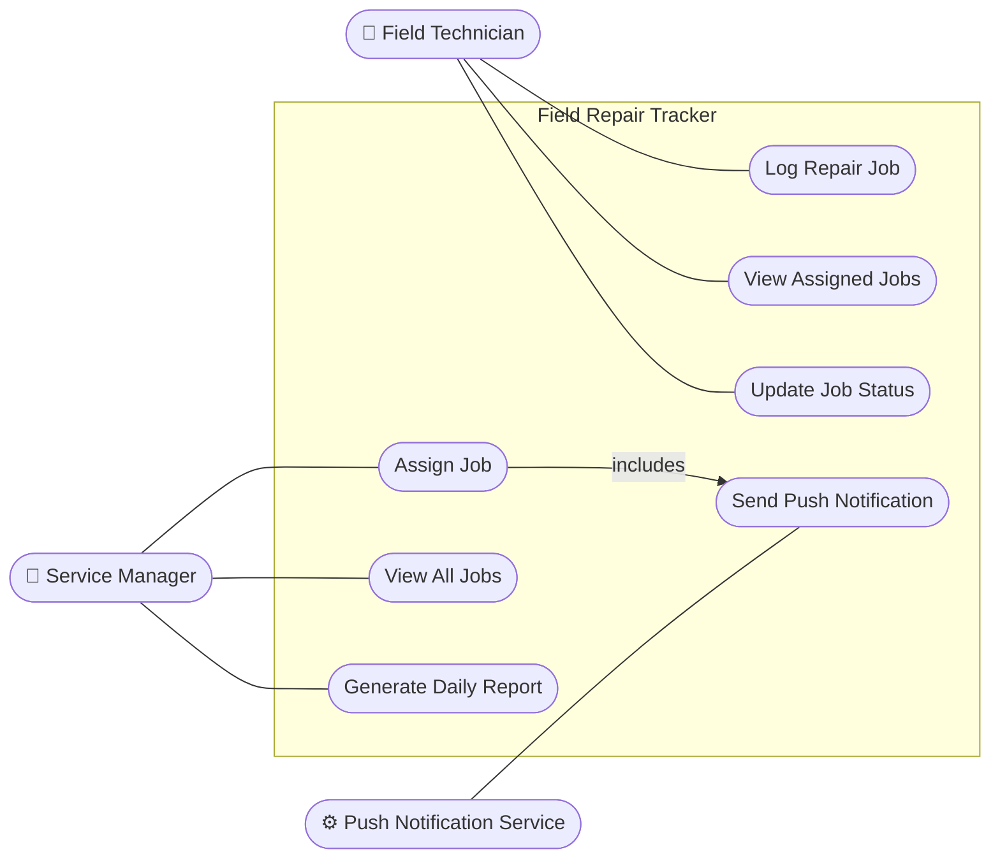
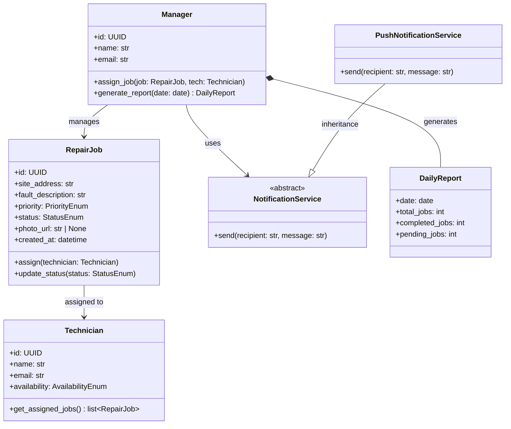
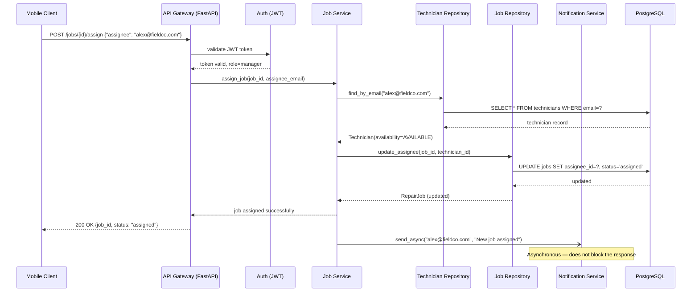

# Chapter 7: Agentic SWE in SDLC: Hands-on Activities

> *"The real leverage of AI in software engineering is not that it writes code faster — it is that it compresses the feedback loop between an idea and a working, tested, reviewed artefact."*

---

## Learning Objectives

By the end of this chapter, you will be able to:

1. Apply AI coding agents across every phase of the SDLC using a single, evolving scenario.
2. Use prompting techniques to refine vague requirements into well-formed specifications.
3. Direct an AI agent to analyse requirement quality and generate Gherkin acceptance criteria.
4. Use an AI agent to produce UML diagrams from a requirement document and critique their design quality.
5. Generate implementation code from a specification and design artefact using an AI agent.
6. Generate a complete, meaningful unit test suite from AI-produced code and evaluate its quality.

---

## 7.1 The Running Scenario

Every activity in this chapter builds on the same system and the same vague, realistic starting point — a request that mirrors what engineers actually receive from non-technical stakeholders.

### 7.1.1 The Starting Brief

> *"We need a system where field technicians can log repair jobs from their phones. A manager should be able to see all the jobs and assign them to technicians. We also want some kind of notification when a job gets assigned. It should be fast and work offline sometimes."*

This brief is intentionally incomplete. It contains:

- **Ambiguous actors**: who exactly is a "field technician"? Can a technician also be a manager?
- **Vague behaviour**: what does "log a repair job" mean? What fields are required?
- **Unresolved constraints**: "work offline sometimes" is not a testable requirement
- **Missing error cases**: what happens when a job is assigned to an unavailable technician?
- **No non-functional measurability**: "fast" is not a requirement

This is the raw material for the activities that follow. By the end of the chapter, the brief will have been transformed into a fully specified, designed, implemented, and tested feature — using AI agents at every step.

### 7.1.2 The System: Field Repair Tracker

For context, here is the system as it will exist after the activities are complete:

| Property | Value |
|---|---|
| **System name** | Field Repair Tracker |
| **Domain** | Field service management |
| **Primary actors** | Field Technician, Service Manager |
| **External systems** | Push Notification Service (FCM/APNs), PostgreSQL database |
| **Stack** | Python 3.12, FastAPI, PostgreSQL, pytest |
| **Target deployment** | Cloud-hosted API; mobile clients connect over HTTPS |

---

## 7.2 Activity 1 — AI for Requirements Engineering

**Concepts covered:** Requirement elicitation, quality analysis, user story generation, acceptance criteria

**Format:** Individual | **Duration:** 45 min | **Tool:** Claude Code or any chat-based AI assistant

### 7.2.1 Background

In Chapter 2, you learned to elicit requirements from stakeholders and write them in structured formats. In this activity, you will use an AI agent to perform three requirements engineering tasks on the starting brief:

1. **Refinement** — ask the AI to identify ambiguities, ask clarifying questions, and produce a refined requirement set
2. **Quality analysis** — ask the AI to audit the refined requirements against the IEEE 830 quality attributes (correct, unambiguous, complete, consistent, verifiable, traceable, prioritised)
3. **Acceptance criteria generation** — ask the AI to generate Gherkin scenarios for the most important user stories

### 7.2.2 Phase 1 — Elicitation and Refinement (15 min)

Paste the starting brief into your AI agent and use the following prompt:

> *"You are an experienced requirements engineer. I will give you a raw client brief for a software system. Your job is to:*
> *1. Identify every ambiguity, gap, or assumption hidden in the brief.*
> *2. For each gap, ask a clarifying question that a real stakeholder could answer.*
> *3. After I answer your questions, produce a refined set of requirements: at least 5 functional requirements in 'The system shall…' format, and at least 3 non-functional requirements that are measurable.*
>
> *Here is the brief: [paste the starting brief from §7.1.1]*"

Answer the AI's clarifying questions using the following stakeholder answers:

- A field technician can only view and update their own jobs; they cannot assign jobs to others
- A service manager can view all jobs, assign any job to any technician, and generate a daily summary report
- "Log a repair job" means: create a job record with a site address, fault description, priority (low / medium / high / critical), and an optional photo attachment
- "Work offline sometimes" means: technicians must be able to view their currently assigned jobs when there is no network connection; creating new jobs requires connectivity
- "Fast" means: the API shall respond to 95% of requests within 300 ms under a load of 200 concurrent users

**Expected output:** A refined requirement set. Save it — you will use it in every subsequent activity.

**Check your output:** Apply the quality attribute table from Chapter 2, §2.4. Can you identify any remaining ambiguities or non-measurable NFRs? Fix them before moving on.

> See [Sample Answer: Activity 1 — Acceptance Criteria](#sample-answer-activity-1--acceptance-criteria) at the end of this chapter.

### 7.2.3 Phase 2 — Quality Analysis (10 min)

Ask the AI to audit the requirements it just produced:

> *"Now audit the requirements you just wrote against the IEEE 830 quality attributes: correct, unambiguous, complete, consistent, verifiable, traceable, and prioritised. For each attribute, give a score of Pass / Partial / Fail and a one-sentence justification. Then list the top 3 requirements most at risk of causing problems downstream if left as-is."*

Review the AI's audit. Do you agree with its assessment? Note any requirements you would rewrite based on its feedback.

> **Important:** AI quality audits are often too generous. The AI produced the requirements and tends to score its own output highly. Read each "Pass" verdict critically — could a developer interpret that requirement in two different ways?

### 7.2.4 Phase 3 — User Stories and Acceptance Criteria (20 min)

Ask the AI to generate structured work items:

> *"From the refined requirements, produce:*
> *1. An epic breakdown — group the requirements into 3–4 epics.*
> *2. For the epic 'Job Lifecycle Management', produce 4 user stories in 'As a [role], I want to [action] so that [benefit]' format.*
> *3. For the user story 'assign a job to a field technician', write acceptance criteria in Gherkin format. Include: one happy-path scenario, one error scenario (technician not available), and one authorisation scenario (a regular technician attempts to assign a job)."*

**Check your output:** Are all three acceptance criteria scenarios testable without ambiguity? Could a tester determine pass or fail from each scenario alone, without asking the author?

> See [Sample Answer: Activity 1 — Acceptance Criteria](#sample-answer-activity-1--acceptance-criteria) at the end of this chapter.

---

## 7.3 Activity 2 — AI for Software Design

**Concepts covered:** UML diagrams, class design, sequence diagrams, design critique

**Format:** Individual | **Duration:** 45 min | **Tool:** Claude Code or any AI assistant with Mermaid support

### 7.3.1 Background

In Chapter 3, you learned to read and produce UML diagrams and to apply design patterns. In this activity, you will direct an AI agent to produce design artefacts from the refined requirements — then critique whether those artefacts reflect good design.

### 7.3.2 Phase 1 — Use Case Diagram (10 min)

Provide the AI with your refined requirements and ask:

> *"You are a software architect. Given the requirements below, produce a UML use case diagram in Mermaid syntax. Include all actors (human and system), all use cases, and any include or extend relationships. Follow the style from the example below.*
>
> *Requirements: [paste your refined requirements from Activity 1]*"

**Review questions:**
- Are all actors from the requirements represented?
- Is every use case traceable to at least one requirement?
- Does the `includes` relationship correctly capture mandatory sub-behaviours?

> See [Sample Answer: Activity 2 — Use Case Diagram](#sample-answer-activity-2--use-case-diagram) at the end of this chapter.

### 7.3.3 Phase 2 — Class Diagram (15 min)

Ask the AI to produce a class diagram:

> *"Now produce a UML class diagram in Mermaid syntax for the core domain model. Include: all domain classes with their key attributes and methods, all relationships (association, composition, aggregation, inheritance) with labels, and at least one design pattern. Justify your choice of pattern."*

**Design critique prompt:** After the AI produces its class diagram, ask:

> *"Critique the class diagram you just produced. Identify any violations of SOLID principles, any missing abstractions, and any relationships that could cause problems as the system scales. Suggest two concrete improvements."*

Compare the AI's self-critique with your own reading. Do you agree? Is the `Manager` class doing too much? Should job assignment be delegated to a service layer rather than placed on the `Manager` entity?

> See [Sample Answer: Activity 2 — Class Diagram](#sample-answer-activity-2--class-diagram) at the end of this chapter.

### 7.3.4 Phase 3 — Sequence Diagram (20 min)

Ask the AI to trace the most complex use case end-to-end:

> *"Produce a UML sequence diagram in Mermaid syntax for the 'Assign Job' use case. The system uses a layered architecture: API Gateway → Service Layer → Repository Layer → Database. The API Gateway validates a JWT token before passing the request to the service layer. After a successful assignment, the service sends a push notification asynchronously."*

**Review questions:**
- Does the diagram show the asynchronous notification correctly — not blocking the HTTP response?
- Is JWT validation happening at the right layer?
- Are all components visible in the sequence traceable to the component diagram from Chapter 3?

> See [Sample Answer: Activity 2 — Sequence Diagram](#sample-answer-activity-2--sequence-diagram) at the end of this chapter.

---

## 7.4 Activity 3 — AI for Coding

**Concepts covered:** Specification-driven code generation, code review of AI output, layered architecture

**Format:** Individual | **Duration:** 45 min | **Tool:** Claude Code (CLI)

### 7.4.1 Background

In Chapter 6, you learned that code generation is only as good as the specification that drives it. In this activity, you will use Claude Code to generate the implementation of the `assign_job` feature — the most complex use case in the system — from the requirements and design artefacts produced in Activities 1 and 2.

### 7.4.2 Preparing the Specification

Before invoking the agent, assemble a specification document. Save it as `spec_assign_job.md`:

```markdown
# Specification: Assign Job to Technician

## Context
Field Repair Tracker REST API. Layered architecture: FastAPI → Service Layer → 
Repository Layer → PostgreSQL. Authentication via JWT middleware already implemented.

## Endpoint
POST /jobs/{job_id}/assign

## Access Control
- Only users with role=manager may call this endpoint
- A 403 response is returned for any other role

## Request Body
{
  "assignee_email": "string"   // email address of the technician
}

## Business Rules
1. The job must exist. Return 404 if not found.
2. The technician must exist and have availability=AVAILABLE. Return 409 if not available.
3. On success: update job.assignee_id, set job.status = 'assigned', persist to database.
4. After a successful assignment, send a push notification to the technician 
   asynchronously (do not await — must not block the HTTP response).

## Response (200 OK)
{
  "job_id": "uuid",
  "assignee_email": "string",
  "status": "assigned"
}

## Error Responses
| Code | Condition |
|------|-----------|
| 400  | Request body missing or malformed |
| 403  | Caller is not a manager |
| 404  | Job not found |
| 409  | Technician not found or not available |

## Constraints
- Use dependency injection for the repository and notification service
- All functions must have type annotations
- Do not use global state
- The notification call must be non-blocking (use asyncio.create_task or BackgroundTasks)
```

### 7.4.3 Invoking Claude Code

Open a terminal in your project directory and run:

```bash
claude
```

Then give Claude Code the following prompt:

> *"Read spec_assign_job.md. Implement the assign job feature for the Field Repair Tracker API. Produce:*
> *1. `src/domain/repair_job.py` — the RepairJob and Technician domain models as dataclasses*
> *2. `src/repository/job_repository.py` — a JobRepository with find_by_id and update_assignee methods; use an abstract base class*
> *3. `src/service/job_service.py` — an AssignJobService with an assign method that enforces all business rules from the spec*
> *4. `src/api/job_router.py` — the FastAPI router with the POST /jobs/{job_id}/assign endpoint*
>
> *Follow the constraints in the spec exactly. Use Python 3.12 type annotations throughout."*

### 7.4.4 Reviewing the Generated Code

After generation, review the output against the following checklist. For each item, either confirm it is satisfied or ask the AI to fix it:

| Check | What to look for |
|---|---|
| **Correctness** | Does `assign` raise the right exception for each error condition? |
| **Type safety** | Are all function signatures fully annotated, including return types? |
| **Dependency injection** | Are repository and notification service injected, not imported directly? |
| **Non-blocking notification** | Is the notification call wrapped in `BackgroundTasks` or `asyncio.create_task`? |
| **Status code accuracy** | Does the router return 409 (not 400) for an unavailable technician? |
| **No global state** | Are there any module-level variables that hold mutable state? |

If the AI missed any of these, use a follow-up prompt:

> *"The notification send is currently blocking the HTTP response. Refactor it to use FastAPI's BackgroundTasks so the response is returned before the notification is sent."*

### 7.4.5 What AI Does Well and Poorly Here

After reviewing the output, reflect on the following:

**AI tends to do well at:**
- Generating boilerplate (dataclasses, Pydantic models, router structure)
- Applying patterns it has seen many times (repository pattern, dependency injection in FastAPI)
- Consistent naming and type annotation when the spec is precise

**AI tends to do poorly at:**
- Distinguishing between 400 and 409 status codes without explicit instruction
- Making notification calls truly non-blocking without being prompted
- Handling subtle business rules ("availability must be AVAILABLE at the time of assignment, not at the time the technician record was last updated")

These are not AI failures — they are specification gaps. Every item the AI gets wrong points to a place where the specification was ambiguous.

---

## 7.5 Activity 4 — AI for Testing

**Concepts covered:** Test generation, test quality evaluation, coverage analysis

**Format:** Individual | **Duration:** 45 min | **Tool:** Claude Code (CLI)

### 7.5.1 Background

In Chapter 4, you learned to write unit tests with pytest, to evaluate coverage, and to critically assess AI-generated tests. In this activity, you will use Claude Code to generate a full unit test suite for the `AssignJobService` produced in Activity 3 — and then apply the evaluation criteria from Chapter 4, §4.9.3 to assess its quality.

### 7.5.2 Generating the Test Suite

In your Claude Code session, give the following prompt:

> *"Read `src/service/job_service.py`. Generate a complete pytest test suite in `tests/test_job_service.py` for the AssignJobService.assign method. Requirements for the test suite:*
> *1. Use pytest fixtures for all shared setup (mock repository, mock notification service, sample job, sample technician)*
> *2. Cover all business rules from the specification: happy path, job not found (404), technician not found (409), technician not available (409), caller not a manager (403)*
> *3. Verify that the notification service is called exactly once on a successful assignment*
> *4. Verify that the notification service is NOT called when assignment fails*
> *5. Use unittest.mock.MagicMock for all external dependencies — do not use a real database*
> *6. Each test method name must describe the scenario it tests (not 'test_1', 'test_assign', etc.)"*

### 7.5.3 Evaluating the Generated Tests

Apply the evaluation checklist from Chapter 4, §4.9.3 to the AI-generated suite:

**1. Does each test assert something meaningful?**

Look for tests that call `assign(...)` and only assert `result is not None`. These provide no value. Every test should assert a specific outcome: the returned job has the correct status, the repository's `update_assignee` was called with the correct arguments, or a specific exception was raised.

**2. Are the boundary cases covered?**

The specification has three error conditions. Count how many the AI tested. If any are missing, add them manually — do not ask the AI to fix this, so you can experience the gap directly.

**3. Is the notification call verified correctly?**

A common AI mistake is to assert `mock_notifier.send.assert_called()` (was it called at all?) rather than `mock_notifier.send.assert_called_once_with(expected_email, expected_message)`. The latter is a much stronger assertion.

**4. Are the tests isolated?**

Check that no test depends on the order in which tests run. If a fixture is modified inside a test (e.g., a list is appended to), subsequent tests may receive different state.

> See [Sample Answer: Activity 4 — Unit Test Suite](#sample-answer-activity-4--unit-test-suite) at the end of this chapter.

### 7.5.4 Coverage Analysis

Run the test suite with coverage:

```bash
pytest tests/test_job_service.py -v --cov=src/service --cov-report=term-missing
```

If coverage is below 90% for `job_service.py`, identify the uncovered lines and ask the AI to explain what scenario each uncovered line represents. Then write a test for each gap — by hand, not by AI — so you experience what it means to design a test for a specific scenario rather than generate tests in bulk.

### 7.5.5 Reflection

After completing all four activities, consider:

1. **Where did AI save the most time?** Generating boilerplate (models, routers, fixtures) is typically where AI provides the highest leverage.
2. **Where did AI create the most risk?** Missing error conditions, non-blocking behaviour, and test assertions that check presence but not content are the most common gaps.
3. **What did the specification do?** Compare the quality of AI output in Activity 3 (where you provided a structured spec) with what you would have received from the raw starting brief. The difference is not the AI — it is the specification.
4. **What would the starting brief have produced?** Try asking the AI to generate a class diagram from the raw brief (§7.1.1) without any refinement. Compare it to the output from Activity 2. This difference is the value of requirements engineering.

---

## Chapter Summary

This chapter applied AI coding agents to all four phases of the SDLC using a single evolving scenario — from a vague client brief to a tested, reviewable feature:

| Phase | Activity | AI Role | Human Role |
|---|---|---|---|
| **Requirements** | Activity 1 | Identify ambiguities, draft requirements, generate acceptance criteria | Answer clarifying questions, audit quality, reject vague NFRs |
| **Design** | Activity 2 | Produce use case, class, and sequence diagrams | Verify design against requirements, critique SOLID violations |
| **Implementation** | Activity 3 | Generate layered implementation from a structured spec | Write the spec, review for business rule correctness |
| **Testing** | Activity 4 | Generate pytest fixtures and test cases | Evaluate assertion quality, fill coverage gaps by hand |

The pattern that emerges is consistent: AI compresses the time to a first draft, but the quality of that draft is determined by the precision of the input. Vague briefs produce vague designs; precise specifications produce implementations that need only targeted corrections.

---

## Review Questions

1. The starting brief contained the constraint "work offline sometimes." How did you translate this into a testable non-functional requirement? What made the original phrasing unusable as a requirement?

2. In Activity 2, you were asked to critique the AI's class diagram for SOLID violations. Identify one likely violation in the `Manager` class and explain which principle it violates and how you would fix it.

3. In Activity 3, the AI was likely to make the notification call blocking unless explicitly instructed otherwise. Why is this a specification problem rather than an AI problem?

4. Compare the test `assert result is not None` with `assert result.status == StatusEnum.ASSIGNED`. Why is the second assertion stronger? What specific bug could the first test miss?

5. If you were to add a fifth activity covering deployment (Chapter 4, §4.8), what would you ask the AI to generate, and what would you review manually before merging the generated pipeline configuration?

---

## Sample Answers

*Attempt each activity fully before expanding these answers. The value of the exercises comes from comparing your AI's output against a reference — not from reading the reference first.*

---

### Sample Answer: Activity 1 — Acceptance Criteria

<details>
<summary>Click to reveal sample Gherkin acceptance criteria for the Assign Job user story</summary>

```gherkin
Scenario: Successfully assigning a job to an available technician
  Given I am authenticated as a Service Manager
  And a job with ID "job-42" exists with status "unassigned"
  And a technician "alex@fieldco.com" exists and is available
  When I send POST /jobs/job-42/assign with body {"assignee": "alex@fieldco.com"}
  Then the response status is 200
  And the job's assignee is updated to "alex@fieldco.com"
  And the job status changes to "assigned"
  And alex receives a push notification within 10 seconds

Scenario: Attempting to assign a job to an unavailable technician
  Given I am authenticated as a Service Manager
  And a job with ID "job-42" exists
  And technician "alex@fieldco.com" has status "on_leave"
  When I send POST /jobs/job-42/assign with body {"assignee": "alex@fieldco.com"}
  Then the response status is 409
  And the response body contains {"error": "Technician is not available"}

Scenario: Field technician attempts to assign a job
  Given I am authenticated as a Field Technician (not a manager)
  When I send POST /jobs/job-42/assign with body {"assignee": "sam@fieldco.com"}
  Then the response status is 403
  And the response body contains {"error": "Insufficient permissions"}
```

**What to look for in your own output:**
- Each scenario has exactly one `When` — scenarios with multiple actions are testing more than one behaviour
- The happy-path scenario asserts both the data change *and* the side effect (notification)
- The error scenarios assert the specific HTTP status code and error message body, not just "an error occurred"

</details>

---

### Sample Answer: Activity 2 — Use Case Diagram

<details>
<summary>Click to reveal sample use case diagram in Mermaid</summary>



**What to look for in your own output:**
- The `includes` arrow from Assign Job → Send Push Notification captures that notification is *mandatory*, not optional
- The Field Technician should not have a line to UC4 (Assign Job) — that is a manager-only action
- View All Jobs (UC5) is manager-only; View Assigned Jobs (UC2) is technician-only — these are distinct use cases even though both involve "viewing jobs"

</details>

---

### Sample Answer: Activity 2 — Class Diagram

<details>
<summary>Click to reveal sample class diagram in Mermaid</summary>



**Known design weaknesses to discuss:**
- The `Manager` class violates the Single Responsibility Principle — it handles both assignment logic and report generation. In a production system, these would move to a `JobAssignmentService` and a `ReportingService`.
- `assign_job` on `Manager` means the Manager entity knows about the NotificationService — this couples a domain object to an infrastructure concern. Assignment logic belongs in a service layer, not on a domain entity.
- `DailyReport` using composition (`*--`) is correct only if a report is generated fresh each time; if reports are persisted, the relationship should be association.

</details>

---

### Sample Answer: Activity 2 — Sequence Diagram

<details>
<summary>Click to reveal sample sequence diagram in Mermaid</summary>



**What to look for in your own output:**
- The `->>` arrow to Notify should be `--)` or use a `Note` to indicate the call is asynchronous and does not block the response path
- The 200 OK response to the client should appear *before* the notification call in the sequence — if your diagram shows the notification completing before the response is sent, the design is blocking
- JWT validation should happen at the API Gateway layer, not inside the Job Service

</details>

---

### Sample Answer: Activity 4 — Unit Test Suite

<details>
<summary>Click to reveal sample pytest test suite for AssignJobService</summary>

```python
# tests/test_job_service.py
import pytest
from unittest.mock import MagicMock
from uuid import uuid4

from src.service.job_service import AssignJobService, JobNotFoundError, TechnicianNotAvailableError
from src.domain.repair_job import RepairJob, Technician, StatusEnum, AvailabilityEnum


@pytest.fixture
def mock_job_repo():
    return MagicMock()


@pytest.fixture
def mock_tech_repo():
    return MagicMock()


@pytest.fixture
def mock_notifier():
    return MagicMock()


@pytest.fixture
def service(mock_job_repo, mock_tech_repo, mock_notifier):
    return AssignJobService(
        job_repo=mock_job_repo,
        tech_repo=mock_tech_repo,
        notifier=mock_notifier,
    )


@pytest.fixture
def available_technician():
    return Technician(
        id=uuid4(),
        name="Alex Chen",
        email="alex@fieldco.com",
        availability=AvailabilityEnum.AVAILABLE,
    )


@pytest.fixture
def unassigned_job():
    return RepairJob(
        id=uuid4(),
        site_address="123 Main St",
        fault_description="Power outage",
        priority="high",
        status=StatusEnum.UNASSIGNED,
    )


class TestAssignJob:
    def test_assigns_job_to_available_technician(
        self, service, mock_job_repo, mock_tech_repo,
        unassigned_job, available_technician
    ) -> None:
        mock_job_repo.find_by_id.return_value = unassigned_job
        mock_tech_repo.find_by_email.return_value = available_technician

        result = service.assign(job_id=unassigned_job.id, assignee_email="alex@fieldco.com")

        assert result.status == StatusEnum.ASSIGNED
        assert result.assignee_id == available_technician.id
        mock_job_repo.update_assignee.assert_called_once_with(
            unassigned_job.id, available_technician.id
        )

    def test_sends_notification_on_successful_assignment(
        self, service, mock_job_repo, mock_tech_repo, mock_notifier,
        unassigned_job, available_technician
    ) -> None:
        mock_job_repo.find_by_id.return_value = unassigned_job
        mock_tech_repo.find_by_email.return_value = available_technician

        service.assign(job_id=unassigned_job.id, assignee_email="alex@fieldco.com")

        mock_notifier.send.assert_called_once_with(
            recipient="alex@fieldco.com",
            message=f"You have been assigned job {unassigned_job.id}",
        )

    def test_raises_job_not_found_when_job_does_not_exist(
        self, service, mock_job_repo
    ) -> None:
        mock_job_repo.find_by_id.return_value = None

        with pytest.raises(JobNotFoundError):
            service.assign(job_id=uuid4(), assignee_email="alex@fieldco.com")

    def test_does_not_send_notification_when_job_not_found(
        self, service, mock_job_repo, mock_notifier
    ) -> None:
        mock_job_repo.find_by_id.return_value = None

        with pytest.raises(JobNotFoundError):
            service.assign(job_id=uuid4(), assignee_email="alex@fieldco.com")

        mock_notifier.send.assert_not_called()

    def test_raises_technician_not_available_when_on_leave(
        self, service, mock_job_repo, mock_tech_repo, unassigned_job
    ) -> None:
        on_leave_tech = Technician(
            id=uuid4(),
            name="Sam Rivera",
            email="sam@fieldco.com",
            availability=AvailabilityEnum.ON_LEAVE,
        )
        mock_job_repo.find_by_id.return_value = unassigned_job
        mock_tech_repo.find_by_email.return_value = on_leave_tech

        with pytest.raises(TechnicianNotAvailableError):
            service.assign(job_id=unassigned_job.id, assignee_email="sam@fieldco.com")

    def test_does_not_send_notification_when_technician_not_available(
        self, service, mock_job_repo, mock_tech_repo, mock_notifier, unassigned_job
    ) -> None:
        on_leave_tech = Technician(
            id=uuid4(),
            name="Sam Rivera",
            email="sam@fieldco.com",
            availability=AvailabilityEnum.ON_LEAVE,
        )
        mock_job_repo.find_by_id.return_value = unassigned_job
        mock_tech_repo.find_by_email.return_value = on_leave_tech

        with pytest.raises(TechnicianNotAvailableError):
            service.assign(job_id=unassigned_job.id, assignee_email="sam@fieldco.com")

        mock_notifier.send.assert_not_called()
```

**What to look for in your own output:**
- Does your AI generate `assert result is not None` instead of `assert result.status == StatusEnum.ASSIGNED`? The former passes even if the assignment logic sets the wrong status.
- Does your AI use `assert_called()` instead of `assert_called_once_with(...)`? The former does not verify the arguments passed to the notifier.
- Is the "notification not called on failure" test present? AI frequently omits this negative assertion, leaving a gap where a buggy implementation that always notifies would still pass.

</details>
