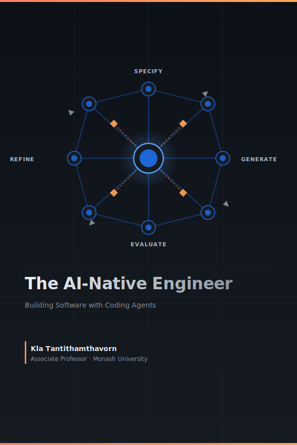

<div style="display:flex; justify-content:center; padding: 2rem 0;">
  
</div>

# Preface

## About This Book

This book is about a fundamental shift in what software engineers actually do.

For most of the history of the profession, the primary bottleneck in software development was *writing code*: turning a clear understanding of the problem into a working implementation. Tools, languages, and frameworks were all designed to help engineers write code faster, more reliably, and with fewer defects. Being a great engineer meant, in large part, being a great coder.

That bottleneck is moving — fast.

AI agents can now write syntactically correct, contextually relevant code from a natural language description. They can scaffold entire systems, generate test suites, refactor legacy code, and explain unfamiliar codebases in seconds. The implementation layer — once the core of the engineer's craft — is increasingly automated.

What remains irreducibly human is everything that surrounds implementation: **understanding the problem deeply, specifying intent precisely, verifying that what was produced is actually correct, and refining until it is truly right.**

This is the new loop of software engineering in the agentic era:

```
SPECIFY → GENERATE → VERIFY → REFINE
```

**Specify** — Define the problem with precision. Decompose ambiguous requirements into clear, agent-sized tasks. Write specifications that leave no room for misinterpretation.

**Generate** — Delegate to AI agents with confidence. Provide the right context, constraints, and success criteria. Let agents handle the implementation.

**Verify** — Review outputs critically and systematically. Test assumptions. Catch hallucinations, edge cases, and silent failures before they reach production.

**Refine** — Iterate. Improve your specifications, your prompts, your verification strategies. Each cycle makes the next one faster and more accurate.

This loop replaces the old SDLC — not by discarding its principles, but by redistributing where human intelligence is most needed. The engineer moves up the abstraction stack: from implementer to architect, from coder to critic, from builder to director.

This book teaches that move. It is not a book about which AI tools to use or how to write clever prompts. It is a book about the new skills that matter when coding is automated: problem decomposition, system thinking, critical verification, and judgment under uncertainty. Skills that compound. Skills that do not expire when the next model is released.

---

## Who This Book Is For

**Primary readers:**
- Software engineers transitioning from traditional to AI-assisted workflows who want sustainable, tool-independent skills
- Advanced undergraduate and graduate students in software engineering
- Senior developers and tech leads adapting team practices

**Secondary readers:**
- Engineering managers redefining development processes
- Researchers in software engineering

**What you need to bring:**
- Comfort with at least one programming language (examples are in Python)
- Familiarity with basic programming concepts: functions, classes, loops, conditionals
- Some exposure to version control (git) and the command line

**What you do not need:**
- Prior experience with AI coding tools
- A background in machine learning or deep learning
- Advanced knowledge of Python — the examples use standard library features and widely-adopted packages

---

## How to Use This Book

This book is written for a 12-week university course at Monash University, but it is structured so that it can be used in several ways.

### Path A: 12-Week Course (Recommended)

Follow the chapters in order, one per week. Each chapter builds on the previous and contributes one milestone to the running course project — a Task Management API that grows from a scope statement (Week 1) to a complete AI-native system (Week 12).

```
Weeks 1–5:  SE Fundamentals (Chapters 1–5)
Weeks 6–9:  Agentic Software Engineering (Chapters 6–9)
Weeks 10–12: Engineering with Responsibility (Chapters 10–12)
```

The project milestones at the end of each chapter are the primary assessment vehicle. Submit them on a weekly cadence and use peer review to compare approaches.

### Path B: Practitioner Self-Study

If you are an experienced engineer who wants to develop AI-native skills specifically, start with Chapter 6 (Agentic Software Engineering: A New Paradigm) to calibrate where you are, then read Chapters 7–9 in order. Use Chapters 1–5 as reference when the foundations feel shaky, and Chapters 10–12 for the governance and strategy dimensions.

Recommended reading order: 6 → 7 → 8 → 9 → 10 → 1–5 (reference) → 11 → 12

### Path C: Team Reference

If your team is adopting AI tools and you want to use this as a shared reference, the most immediately useful chapters are:

| Need | Chapter |
|---|---|
| Software security and threat modelling foundations | 5 |
| Adopting an agentic engineering paradigm | 6 |
| Hands-on agentic SDLC practices | 7 |
| Security risks in agentic workflows | 8 |
| Configuring agents with context, skills, and tools | 9 |
| AI use policies and ethics | 10 |
| Measuring team productivity | 11 |

---

## On the Use of AI in Writing This Book
Parts of this book were developed in active collaboration with AI agents. Claude served as an intellectual sparring partner throughout — used to stress-test arguments, surface counterexamples, sharpen explanations, and pressure-check the framing of new ideas. Several figures and conceptual illustrations were produced with the assistance of AI image generation tools (ChatGPT and Gemini). This is intentional, not incidental: a book about working alongside AI agents should, in practice, reflect that collaboration honestly. Every claim, conclusion, and piece of code has been reviewed, verified, and is the author's own responsibility. AI acted as a rigorous interlocutor and creative collaborator — not a ghostwriter. 

## Disclaimers

All code examples in this book use Python. This choice is deliberate and transparent, not an endorsement.

**This is not a sponsored book.** No commercial relationship exists between the author or any other AI provider mentioned.

**This book does not represent the views of Monash University.** It is written in a personal capacity and is not endorsed by, affiliated with, or produced on behalf of Monash University or any other institution. Readers are responsible for applying the concepts and techniques described here thoughtfully and at their own discretion. The author accepts no liability for decisions or outcomes arising from the use of this material.

<!-- **These principles apply to any LLM provider.** Every concept in this book — the AI-native SDLC, specification design, evaluation-driven development, agentic orchestration — applies equally to OpenAI GPT models, Google Gemini, Meta Llama, Mistral, and future models not yet released. The Anthropic API is the *implementation vehicle*, not the *subject*. Where examples use Anthropic-specific classes (`anthropic.Anthropic()`, `client.messages.create()`), the equivalent calls for other providers are:

| Concept | Anthropic (this book) | OpenAI equivalent | Generic pattern |
|---|---|---|---|
| Client init | `anthropic.Anthropic()` | `openai.OpenAI()` | Provider client |
| Completion | `client.messages.create(model=..., messages=[...])` | `client.chat.completions.create(model=..., messages=[...])` | Call with model + messages |
| System prompt | `system="..."` parameter | `{"role": "system", "content": "..."}` in messages | First message or system param |
| Tool definition | `tools=[{name, description, input_schema}]` | `tools=[{type, function: {name, description, parameters}}]` | JSON schema per tool |

See [Appendix C](./appendix_c.md) for provider-agnostic wrappers and guidance on applying these examples to other languages.

**Models change.** The specific model IDs used in examples (`claude-opus-4-7`, `claude-haiku-4-5-20251001`) are current as of writing. New model versions are released regularly. Always check [https://docs.anthropic.com/en/docs/about-claude/models](https://docs.anthropic.com/en/docs/about-claude/models) for the current model list. The principles in this book are model-version-independent; only the model ID strings need updating.

---

## The Running Project

Starting in Chapter 1, you will build a **Task Management API** — a backend system for software development teams to create projects, manage tasks, assign work, and track progress. This is a deliberately familiar problem domain. The focus is not on inventing a novel application but on applying AI-native engineering practices to a realistic, growing system.

By the end of Chapter 12, you will have:
- A requirements specification and design document
- A Python REST API with full test coverage
- A CI/CD pipeline with automated quality gates
- AI-generated features developed using the Specify → Generate → Verify → Refine cycle
- An agentic workflow that automates a development task
- Security review, licence audit, and responsible AI assessment

The project is intentionally modest in scope so that the *process* — not the product — can be the focus of each week.

---

## Companion Resources

All code examples are available at: [github.com/awsm-research/agentic-swe-book](https://github.com/awsm-research/agentic-swe-book)

For updates on regulatory changes (EU AI Act, etc.) and new tool guidance, check the repository's `UPDATES.md` file. The landscape changes faster than print allows. -->

---

## Contributions and Feedback

This book is a living document. Errors, outdated examples, and gaps in explanation are inevitable — and fixable.

If you spot a mistake, have a suggestion, or want to contribute an example, case study, or exercise, you are warmly welcome to do so. The source is open and maintained at [github.com/awsm-research/agentic-swe-book](https://github.com/awsm-research/agentic-swe-book).

- **Report issues** — open a GitHub issue with the chapter and page reference
- **Suggest improvements** — submit a pull request with a clear description of the change and why it helps readers
- **Share your project** — if you build something interesting using the techniques in this book, open a discussion thread; the best examples may be featured in future editions

All contributions are credited. No contribution is too small.

---

*Associate Professor Kla Tantithamthavorn,*
*Monash University, Australia*
*2026*
